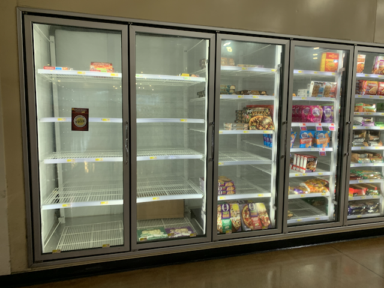
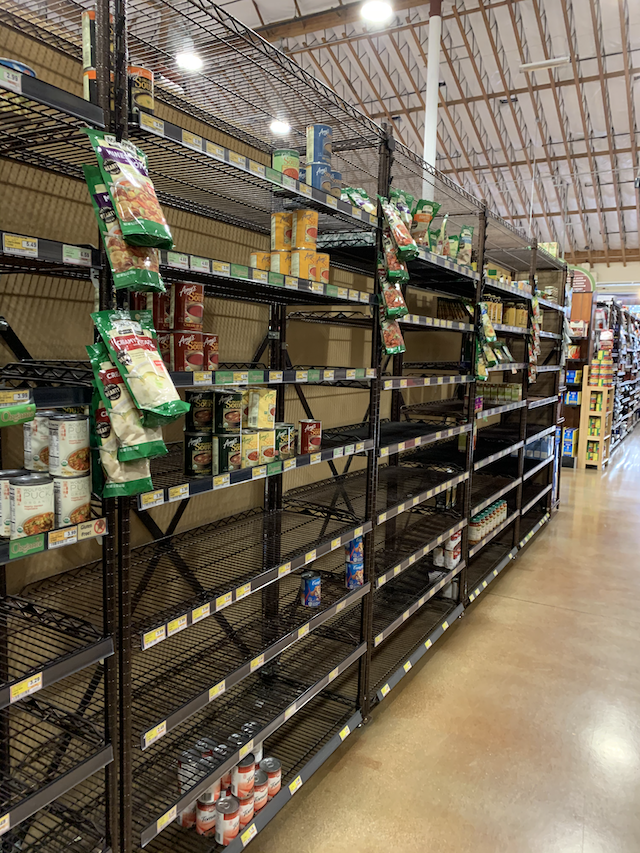
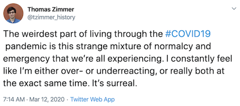
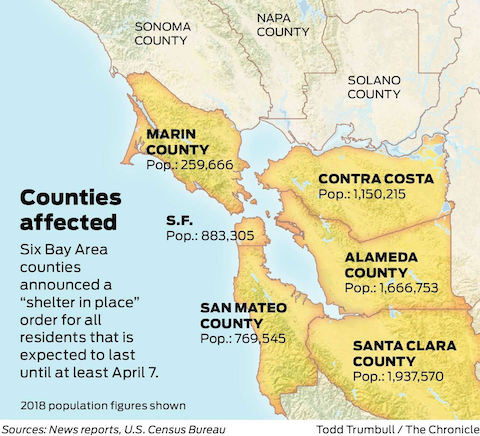
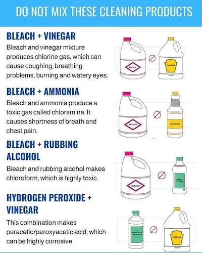

# COVID-19 Journal
My own journal of links, thoughts, and experiences around COVID-19.

## General
* Link: [LinkedIn curated list of COVID-19 news](https://www.linkedin.com/feed/news/coronavirus-official-updates-4513283/)
* Link: [COVID-19 Direct](https://covid-19.direct/US). One of the best trackers I've come across so far. Includes additional data like hospital/bed/ICU capacity.
* Link: [Johns Hopkins CSSE Tracker](https://gisanddata.maps.arcgis.com/apps/opsdashboard/index.html#/bda7594740fd40299423467b48e9ecf6). Dashboard style tracker.

## Mar 25, 2020

My wife's parents drove **direct** from west central Florida to central Nova Scotia on Sunday-into-Monday, getting ahead of the looming coronavirus disaster set to hit Florida (plus wanting to stay ahead of a major snowstorm). Then I read this article today: [Escape from Florida: My 2,400-km drive back to the sanity of Canada](https://www.macleans.ca/society/life/escape-from-florida-my-2400-km-drive-back-to-the-sanity-of-canada/). Her folks will be in self-quarantine for the next 14 days, and their neighbors (excuse me, *neighbours*) have kindly offered to fetch and drop groceries for them. My parents and my brother and his family are still isolating at their places in eastern Tennessee. Speaking of my parents, I did ask them if they'd be willing to forgo quarantine and risk death in order to create shareholder value, but they passed on that idea. 

Let's do some learning:

1. [The Atlantic: How the Pandemic Will End](https://www.theatlantic.com/health/archive/2020/03/how-will-coronavirus-end/608719/). It's full of links to other sources that you can explore further, too. Even if you skip the other links below, I recommend reading this one.

1. [Medium: This Is How Your Immune System Reacts to Coronavirus. And what it means for treatment](https://elemental.medium.com/this-is-how-your-immune-system-reacts-to-coronavirus-cbf5271e530e). One of the concerning aspects of COVID-19 is the stories of it taking out perfectly healthy people in their 30's and 40's -- even 20's -- [Chris Traeger](https://en.wikipedia.org/wiki/Chris_Traeger) types, no prior illnesses, dead within days... while others report they felt kind of down for a day or two (or weren't even symptomatic!) and then were fine. *That* uncertainty causes me a fair bit of distress.

1. [Hackaday: Ventilators 101: What they do and how they work](https://hackaday.com/2020/03/25/ventilators-101-what-they-do-and-how-they-work/). Bonus: I learned some stuff about the CPAP machine I've been using for 11 months now.

Some links:

* [The Hill: Critics hit Florida governor over lack of 'sweeping' coronavirus response](https://thehill.com/homenews/state-watch/489562-critics-lash-out-at-florida-governor-over-lack-of-sweeping-coronavirus). Florida's demographics make it a ticking time bomb.

* [NBC News: Louisiana pastor defies coronavirus order, draws over 1,000 people to services](https://www.nbcnews.com/news/us-news/louisiana-pastor-defies-coronavirus-order-draws-over-1-000-people-n1168501). "The virus, we believe, is politically motivated." I wouldn't know how to help these people. 

* [Jackson Free Press: Governor Orders Limited Gatherings, Declares Most Businesses 'Essential,' Supersedes Local Safety Efforts](https://www.jacksonfreepress.com/news/2020/mar/24/gov-tate-reeves-orders-limited-gatherings-today-ex/). tl;dr a number of municipalities were unhappy that the governor of Mississippi, Tate Reeves, wasn't doing shit, so they enacted their own restrictions. This appears to supercede those restrictions. You probably weren't planning a vacation to Mississippi *anyway* but if you were... you might hold off.

## Mar 24, 2020

It wasn't a good day overall. Lots of negative thoughts and despair. The person I was mentioning yesterday tested *negative* for COVID-19 but then I learned later in the day someone in my extended family tested positive (but is doing OK for the moment, thankfully). Being home-bound since March 5 and fairly anxious **the whole time** is having a physical impact on me. I have low-grade headache and tremors for a good portion of the day, and I'm more prone to mood swings. I'm prescribing myself longer and more frequent walks to try to cope.

Anyway, the next two weeks will be a shit show here in the US. Strap in.

Links:

* [CNBC: India’s prime minister orders lockdown of country of 1.3 billion people for 21 days](https://www.cnbc.com/2020/03/24/coronavirus-indias-prime-minister-orders-nationwide-lockdown.html). India is now closed. 

* [The Guardian: Jerry Falwell Jr defies calls for coronavirus closures and reopens Liberty University](https://www.theguardian.com/us-news/2020/mar/24/liberty-university-reopens-despite-coronavirus-closure-calls-jerry-falwell-jr). "Up to 5,000 students will be allowed to return to Liberty University’s campus after school officials confirmed the conservative Christian school based in Lynchburg, Virginia, will reopen this week." I'll keep an eye out for the follow-up story we all know is coming in around two weeks.

* [Washington Post: The coronavirus isn’t mutating quickly, suggesting a vaccine would offer lasting protection](https://www.washingtonpost.com/). Sorry about the paywall link but here's the gist: "The coronavirus is not mutating significantly as it circulates through the human population, according to scientists who are closely studying the novel pathogen’s genetic code. That relative stability suggests the virus is less likely to become more or less dangerous as it spreads, and represents encouraging news for researchers hoping to create a long-lasting vaccine." You can probably Google around to find more.

* [Buzzfeed: The Coronavirus Is Sending Lots Of Younger People To The Hospital](https://www.buzzfeednews.com/article/stephaniemlee/coronavirus-young-age-severe-cases?bftwnews&utm_term=4ldqpgc#4ldqpgc). "In New York City, health officials said Friday that of 1,160 people hospitalized with COVID-19 symptoms, one in four were between ages 18 and 49."

On the lighter side:

* [WAFB9: Waffle House closes 365 locations across the U.S.](https://www.wafb.com/2020/03/24/waffle-house-closes-locations-across-us/). 365 locations closed, with 1627 remaining open. Maybe I should start charting this daily?

* [CBC: P.E.I. farmer keeps social distance by hurling pork products to hungry customers](https://www.cbc.ca/radio/asithappens/as-it-happens-the-monday-edition-1.5506723/p-e-i-farmer-keeps-social-distance-by-hurling-pork-products-to-hungry-customers-1.5507326). 

* [teleport.fm: Tired of people seeing your “home office” on Zoom? Teleport somewhere better.](https://teleport.fm/). Backgrounds you can download for Zoom. 

## Mar 23, 2020

I am now likely one-degree connected to someone with COVID-19; this person is symptomatic and has taken a test, but the results haven't come back yet. We haven't been near each other physically since the first few days of March. And no, this person hasn't lost their sense of taste or smell; I asked. At this point they are managing the symptoms well and statistically they have an almost 100% chance of making a full recovery.

Links:

* [France24: Madrid ice rink turned into morgue due to coronavirus](https://www.france24.com/en/20200323-madrid-ice-rink-turned-into-morgue-due-to-coronavirus). 
* [TIME: Sen. Rand Paul Remained at Work on U.S. Capitol for Six Days After Coronavirus Test](https://time.com/5808407/sen-rand-paul-senate-capitol-coronavirus/). Sen. Paul is a graduate of the Duke University School of Medicine. Yes, he's an M.D. 
* [Fox 13 Tampa: Hillsborough County leaders postpone possible 'stay-at-home' order, despite Mayor Castor's plea](https://www.fox13news.com/news/hillsborough-county-leaders-postpone-possible-stay-at-home-order-despite-mayor-castors-plea). "[T]he motion that ultimately passed was only to further study a stay-at-home motion and a possible 10 p.m. to 5 a.m. curfew. The group will meet again on Thursday." Decisive leadership.
* [BBC News: Coronavirus: Why India's busiest rail network is being shut down](https://www.bbc.com/news/world-asia-india-51957936). "One of the world's busiest urban rail systems will be shut down for ordinary commuters from Monday morning to prevent the spread of coronavirus infection in Mumbai, one of India's most populous cities. Only government workers in "essential services" will be allowed to travel on a truncated service."
* [Serious Eats: Food Safety and Coronavirus: A Comprehensive Guide](https://www.seriouseats.com/2020/03/food-safety-and-coronavirus-a-comprehensive-guide.html). Food safety and COVID-19 is something that's been on my mind as 1) I'm missing our usual yellow curry and Pad Thai, and 2) a nearby(-ish) restaurant Flights has [transformed into a ‘no touch,’ drive-thru grocery](https://www.mercurynews.com/2020/03/23/los-gatos-restaurant-transformed-into-a-no-touch-drive-thru-grocery/).

And lastly, people all over the internet have been dunking on these people all day, but really it's just sad and unfortunate. 

* [Phoenix New Times: Arizona Man Dies After Trying Substance Touted by Trump to Treat COVID-19](https://www.phoenixnewtimes.com/news/covid-19-remedy-touted-by-trump-kills-arizona-man-wife-critical-11460391). 

## Mar 22, 2020

I've been yelling at people here since February 28 that a storm is coming and you should start making some plans. If you're still not convinced, I can't do anything more at this point than pity you, and hope you find the evidence you need so you can take action before you hurt someone. 

That's it. I've been staring at the screen for 20 minutes trying to think of what more to write. Stay at home. Wash your hands. 

Links:

* [CNN: Rand Paul is first senator to test positive for coronavirus](https://www.cnn.com/2020/03/22/politics/rand-paul-coronavirus/index.html). He had a test (despite being asymptomatic), went to the Senate gym and pool, then received the results later today. 

* [Twitter / The British Association of Otorhinolaryngology: Is a lost sense of smell a marker of COVID-19 infection?](https://twitter.com/ENT_UK/status/1241063677186449408).

## Mar 19, 2020

Here in a 9 county area of Northern California -- including Santa Clara County, where we live -- we've been in a shelter-in-place order for a few days now, though I've been in shelter mode since March 5 when LinkedIn sent us home. Well, [this evening California's governor extended shelter-in-place to the rest of California](https://www.marketwatch.com/story/california-governor-issues-statewide-shelter-in-place-order-2020-03-19), impacting some 40 million people. We can still leave homes for essential needs like food or medical care, and we can still receive deliveries from Amazon and restaurants. We can also get out and go for walks, and the kids can play in the yard, which may help preserve our sanity. [Something like this, in the woodsy mountains and away from it all](https://www.airbnb.com/rooms/13019040?s=67&sharer_id=7285002&unique_share_id=5d9b5798-ad0c-43db-83ac-8acab29fcc19) is starting to look pretty appealing. 

I've been feeling under the weather all day today. My energy level dropped off a cliff mid-morning, I've been doing "catch up" breaths and swallowing more than usual. In the afternoon I was running a faint fever (99.2 / 99.3) but it's possible that was just anxiety, which has been a challenge the past few weeks. I say all that, but I had a banana muffin and ice cream sandwich and felt *much* better after, so maybe it was blood sugar? I'll give it a few days and see.

Some links:

* [YouTube/Channel 4 News: Inside intensive care unit: Italy fights coronavirus outbreak](https://www.youtube.com/watch?v=rfkbv_WQtn0&feature=youtu.be). "Italian hospitals are at their absolute limit, with hundreds more deaths reported daily, and huge challenges in caring for those infected." **WARNING: I'm on the fence about sharing this. You may want to skip it. It doesn't have gore or anything but may make you anxious or concerned. I wanted to highlight the heroes these medical professionals are.**

* [BBC News: Coronavirus and ibuprofen: Separating fact from fiction](https://www.bbc.com/news/51929628). Still trying to suss out the story with ibuprofen. Will probably avoid for now out of an abundance of caution.

* [The Guardian: The tech execs who don't agree with 'soul-stealing' coronavirus safety measures](https://www.theguardian.com/technology/2020/mar/18/tech-execs-who-dont-agree-coronavirus-measures). Don't be Tim Draper (and not just because of this). Don't be Elon Musk. 

* [The Guardian: Japanese flu drug 'clearly effective' in treating coronavirus, says China](https://www.theguardian.com/world/2020/mar/18/japanese-flu-drug-clearly-effective-in-treating-coronavirus-says-china). "[F]avipiravir, developed by a subsidiary of Fujifilm, had produced encouraging outcomes in clinical trials in Wuhan and Shenzhen involving 340 patients."

  > Oh and an aside about [The Guardian](https://www.theguardian.com/us) since I linked them twice: I signed up last night to give them $10/mo as they seem to be one of the more reliable online news sources out there.

* [Los Angeles Times: Woman who flew from U.S. to China for coronavirus test faces criminal charges](https://www.latimes.com/world-nation/story/2020-03-18/woman-who-flew-from-u-s-to-china-for-coronavirus-test-faces-criminal-charges). "The woman took fever-reducing medication before boarding a plane and lied to flight attendants, according to Beijing’s disease control center and an Air China representative, who held a news conference on Monday." "According to Chinese law, she could face up to three years of imprisonment or detention with possible forced labor, or up to seven years of prison if there are “serious consequences.” Hey don't do this.

* [GatesNotes: We’re Not Ready for the Next Epidemic](https://www.gatesnotes.com/Health/We-Are-Not-Ready-for-the-Next-Epidemic). Bill Gates gave a TED talk *five years ago* about how unprepared we were for an epidemic. Here we are.

* [Bloomberg: 99% of Those Who Died From Virus Had Other Illness, Italy Says](https://www.bloomberg.com/news/articles/2020-03-18/99-of-those-who-died-from-virus-had-other-illness-italy-says). "More than 75% had high blood pressure, about 35% had diabetes and a third suffered from heart disease." and "Almost half of the victims suffered from at least three prior illnesses and about a fourth had either one or two previous conditions."

* [SFGate: Whole Foods, Safeway among Bay Area grocery stores offering seniors-only hours](https://www.sfgate.com/bayarea/article/seniors-only-shopping-groceries-bay-area-15137311.php). This started as an article about how Zanotto's, our literally-around-the-corner grocery store, would start offering Senior Hours from 8 to 9 am, but it looks like SFGate has expanded it to include similar hours at other area stores. 

  * I went to Zanotto's last evening about 20 minutes before close and the inventory had been well picked-over. As I'm checking out, the cashier discretely asks me if I also need toilet paper, as they have some behind the counter for people who are making other purchases. I passed.
     
    

* And finally, [this is how I feel](https://twitter.com/tzimmer_history/status/1238106020855066626):

## Mar 16, 2020

Today was the first work-from-home day that also overlapped with the kids' school-from-home day. It went *okay*. 

I want to start by saying I'm **super impressed** with how my employer, LinkedIn, has been handling this difficult situation so far. They were *very* aggressive about promoting work-from-home early on. This is our eighth official WFH day, and they made their call well before it was patently evident it was the right one. 

* Some stock market news. Today was the largest point drop of the Dow in history (−2,997), and the second largest percentage drop (−12.93%, just edging out Oct 28, 1929's -12.82%). 

* [San Francisco Chronicle: Bay Area orders ‘shelter in place,’ only essential businesses open in 6 counties](https://www.sfchronicle.com/local-politics/article/Bay-Area-must-shelter-in-place-Only-15135014.php). This is where we live. "Grocery stores and pharmacies will remain open, and restaurants may stay open to provide takeout food only. Also staying open: veterinary services, gas stations and auto repair shops, hardware and other home supply stores, banks and laundry services." 

* [AP: Government official: Coronavirus vaccine trial starts Monday](https://apnews.com/8089a3d0ec8f9fde971bddd7b3aa2ba1). I know it's a long way away from public use, but good to see some progress.

* **Matt Colvin** will have an SEO problem when he goes to apply for his next job. He's the guy who took a 1,300 mile road trip across Tennessee and into Kentucky to buy and hoard sanitizer and wipes. He didn't want to bring a lot of attention to it, so he [did an interview and photoshoot with the New York Times](https://www.nytimes.com/2020/03/14/technology/coronavirus-purell-wipes-amazon-sellers.html). 

* The Norwegian University of Science and Technology posted their recommendation that all overseas students return home to Norway. "This... applies for countries with poorly developed collective infrastructure, for example the USA." They have since modified the post to remove specific reference to the US, but one wishes they hadn't.

* Heard one case where the poster's parents didn't start to take COVID-19 seriously until [the AARP updated their web site](https://www.aarp.org/). 

* Two links on the same topic of immune system response to COVID-19. 
  * [Science Daily: Deadly immune 'storm' caused by emergent flu infections](https://www.sciencedaily.com/releases/2014/02/140227142250.htm). "Cytokine storm" has come up a few times in our work channels. "A cytokine storm is an overproduction of immune cells and their activating compounds (cytokines), which, in a flu infection, is often associated with a surge of activated immune cells into the lungs. The resulting lung inflammation and fluid buildup can lead to respiratory distress and can be contaminated by a secondary bacterial pneumonia -- often enhancing the mortality in patients." 
  * [Coronavirus: Health official warns against taking ibuprofen as it 'may worsen bug'](https://www.mirror.co.uk/news/uk-news/coronavirus-health-official-warns-against-21697106). tl;dr you might consider taking paracetamol aka Acetaminophen aka TYLENOL instead of ibuprofen. **Do further reading if you're thinking of doing this for kids though!**

* If you're thinking of ginning up your own household sanitizer for some reason, please don't be dumb.

* I'll leave you with this: [A sign of strange times: The Pope blessing an empty St. Peter’s Square.](https://twitter.com/BurkeCNN/status/1239223460720709633?s=20)

## BONUS: Learning Resources for Kids
An awesome parent at work shared a bunch of resources for keeping kids engaged during these strange times. Please see [Resources for Parents](resources-for-parents.md). 

## Mar 13, 2020

I took a mental health day off from work today, and made a concerted effort to **put the phone down** for a good portion of the day. My anxiety has put me in a bad place over the past two weeks, and I strongly attribute it to mainlining coronavirus news. Work-from-home and the wicked stomach bug last weekend ended up with me only leaving the house for ~30 minutes over the past 8 days. Between a virtual happy hour yesterday evening with 9 or 10 work mates, my disconnecting from the news somewhat, and going on a long mountain drive today, I've been able to reset some. 

Why am I so anxious? Statistically, me, my wife, and our kids will eventually catch coronavirus, feel shitty for a bit, and emerge completely fine on the other end. The anxiety stems from the perfect storm of pandemic disease, economic upheaval, and a federal government that is incompetent beyond measure. There is no template for this, and our government seems to be lacking the bright minds at the top who would be able to competently steer the ship in times of uncertainty. So I'm anxious not for me or my family, but for the people who will be injured or killed by a system that should've done a much, much better job.

Links:

* [The Guardian: Trump says he takes 'no responsibility' for coronavirus failures as he declares national emergency](https://www.theguardian.com/us-news/live/2020/mar/13/donald-trump-coronavirus-joe-biden-bernie-sanders-live-updates-news). 

* [The Verge: Contrary to Trump’s claim, Google is not building a nationwide coronavirus screening website](https://www.theverge.com/2020/3/13/21179118/google-coronavirus-testing-screening-website-drive-thru-covid-19). 

* [Cupertino Union School District (CUSD)](https://www.cusdk8.org/cms/lib/CA02218495/Centricity/Domain/3585/3-13-20%20covid%20message%20school%20closure.pdf) -- my kids' school district -- announced today they're closing schools, effective Monday. For now they are closed through April 3, and the District is coordinating with other area school districts to try to move up Spring Break to be at the tail end of the closure period. 

* [CBS News: Johns Hopkins develops its own coronavirus test](https://www.cbsnews.com/news/johns-hopkins-develops-its-own-coronavirus-test/). It's great to have some people who believe in science hanging out in universities who can quickly help out when the need arises. I've read about a few other institutions, such as Stanford and the University of Washington, who also have their own tests and are continuing to improve on the time to get results.

I'm going to stop updating stats on the number of cases and deaths as they're about to explode and there are other sites for that grim information.

## Mar 12, 2020

Santa Clara County started updating their site again, with a new format. There are [66 confirmed cases now](https://www.sccgov.org/sites/phd/DiseaseInformation/novel-coronavirus/Pages/home.aspx), but in reality it's much higher **because nobody is testing**. 

Canceled/postponed/closed/announced closed:
* The NBA
* The NCAA Finals
* The MLB
* The NHL
* Some travel between the US and Europe
* Disneyland, Disney World
* San Francisco Unified School District
* Seattle School District
* [All schools in Ohio, Maryland, and Kentucky](https://www.chicagotribune.com/coronavirus/ct-nw-coronavirus-united-states-school-closings-20200312-sh2d5vi525drvcf5dwm7hnebru-story.html)
* [Broadway shows in NYC](https://www.washingtonpost.com/entertainment/theater_dance/broadway-to-go-dark-as-coronavirus-fears-intensify/2020/03/12/6e007114-648e-11ea-b3fc-7841686c5c57_story.html)

These are the ones announced *in the last 24 hours*.

Today was the largest daily point loss of the Dow Jones Industrial Average ever: -23522 points, or down 9.99%. The second largest point drop was three days ago, on March 9. The third largest was yesterday. It's the fourth largest *percentage* drop ever, missing Oct 29, 1929, by less than 2%. [1](https://en.wikipedia.org/wiki/List_of_largest_daily_changes_in_the_Dow_Jones_Industrial_Average)

On a personal note, I don't know how to convince more people they need to pay attention to this. Still think "It's just like the flu..."? Start paying attention.

## Mar 11, 2020

Links:

* [BBC: Coronavirus confirmed as pandemic by World Health Organization](https://www.bbc.com/news/world-51839944). "[T]he number of cases outside China had increased 13-fold in two weeks."

* [Quartz: This chart of the 1918 Spanish flu shows why social distancing works](https://qz.com/1816060/a-chart-of-the-1918-spanish-flu-shows-why-social-distancing-works/). My employer, LinkedIn, continues to have a work-from-home policy for everyone that is able. 

* A little concerning: Santa Clara County (mine) seems to have stopped updating their [coronavirus page](https://www.sccgov.org/sites/phd/DiseaseInformation/novel-coronavirus/Pages/known-cases-of-coronavirus.aspx) after having kept it diligently updated since January 31. 

* [Seattle Times: Seattle Public Schools to close for two weeks in light of coronavirus concerns](https://www.seattletimes.com/seattle-news/education/seattle-public-schools-to-close-for-two-weeks-in-light-of-coronavirus-concerns/). Starts tomorrow.

* [NPR: Coronavirus: New York Creates 'Containment Area' Around Cluster In New Rochelle](https://www.npr.org/sections/health-shots/2020/03/10/814099444/new-york-creates-containment-area-around-cluster-in-new-rochelle). "A synagogue in the city has become the epicenter of an outbreak in Westchester County — which accounts for 108 of New York state's 173 coronavirus cases."

## Mar 10, 2020

* I've had stomach flu since the evening of Saturday 7th. Sunday is easily in my top 10 worst in recent memory. On Monday I dared to eat some oyster crackers and that went OK. Today -- Tuesday -- I ate an egg and some more crackers. I'm probably at 75% health but glad for it considering the past few days. Definitely wasn't the coronavirus, which I'm not looking forward to (I feel like it's unavoidable at this point, even with social distancing and hand-washing), but also want to get out of the way.

* Son is home from school today with a slight fever, runny nose, and joint aches. 

* The stock market had its largest one day point drop yesterday. It's up a little today but it's a trap.

* As of March 9, in Santa Clara County there are 43 confirmed cases and 1 death. 21 currently hospitalized, with 10 in the ICU. Median age 58 years (range 20-89). Median age of hospitalized cases 66 (range 20-89). From [here](https://www.sccgov.org/sites/phd/DiseaseInformation/novel-coronavirus/Documents/Infographic-Santa-Clara-County-CoronaVirus_8.pdf).

* [Santa Clara County: Order Requiring Cancellation of Mass Gatherings of More than 1,000 Persons](https://www.sccgov.org/sites/phd/DiseaseInformation/novel-coronavirus/Pages/order-cancellation-mass-gatherings.aspx). The actual text of the order is [here](https://www.sccgov.org/sites/phd/DiseaseInformation/novel-coronavirus/Pages/order-health-officer-03092020.aspx). "Effective as of 12:00 a.m. on Wednesday, March 11, 2020, and continuing until 11:59 m. on March 31, 2020, public or private mass gatherings, defined below, are hereby prohibited in Santa Clara County ("County")."

* [#FlattenTheCurve](https://twitter.com/hashtag/FlattenTheCurve) is trending on twitter today. See the chart from Mar 7 below on US healthcare system capacity. 

* [NPR: Italy expands quarantine measures nationwide to stem spread of coronavirus](https://www.npr.org/sections/goatsandsoda/2020/03/09/813791575/italy-expands-quarantine-measures-nationwide-to-stem-spread-of-coronavirus). 

* [USA Today: Trump has not been tested for coronavirus, White House says, despite indirect contact](https://www.usatoday.com/story/news/politics/2020/03/09/trump-has-not-been-tested-coronavirus-white-house-said/5005083002/). Also, [Trump Pitches Coronavirus-Related Stimulus Package on Capitol Hill](https://www.nytimes.com/2020/03/10/business/economy/coronavirus-fema-trump.html).

## Mar 7, 2020

I needed a few days away from writing, though I've been spending a considerable amount of time reading and conversing about coronavirus.

Let's start with this:

I suspect this is why my employer -- and many others in this area -- have either mandated or strongly encouraged their employees to work from home. It's an assumption that we'll *all* be coming down with COVID-19 but that it needs to be spread out in order to have sufficient resourcing to keep the business running. 

For me, there are two schools of thought here:
1. Catch coronavirus sooner rather than later, so that if I do need to see a doctor, I can do so before the health system gets overstressed. Not saying that I'd _actively seek out_ to get COVID-19, but that I wouldn't be Howard Hughes paranoid about germs.
1. Go full hermit to push back catching it as long as possible. It would have to be timed so that it's below the dotted line above. This means staying in, not letting the kids have friends over, eating from our stock of food, and probably getting on each other's nerves a lot. The idea here is to give the healthcare system a chance to scale up and/or work through cases, and scientists time to develop a vaccine.

This cannot be contained at this point. US political leaders are either in denial or too stupid to realize this (flip a coin). 

Assorted links from the past few days:
* [Quest Diagnostics to Launch Coronavirus Disease 2019 (COVID-19) Test](https://newsroom.questdiagnostics.com/2020-03-05-Quest-Diagnostics-to-Launch-Coronavirus-Disease-2019-COVID-19-Test). Quest has a large network so this is welcome news.
* [The Lancet: Therapeutic and triage strategies for 2019 novel coronavirus disease in fever clinics](https://www.thelancet.com/journals/lanres/article/PIIS2213-2600(20)30071-0/fulltext). Includes an informative flowchart for triaging patients.
* [Futurism: Coronavirus could force funerals to be livestreamed](https://futurism.com/the-byte/coronavirus-force-funerals-livestreamed). 
* [Stanford Medicine: Stanford Medicine COVID-19 test now in use](https://med.stanford.edu/news/all-news/2020/03/stanford-medicine-COVID-19-test-now-in-use.html). "The Stanford Clinical Virology Laboratory has deployed an in-house diagnostic test for the virus that causes COVID-19. Rapid identification of infected people could help limit the spread of the virus." I also read a few days ago that University of Washington has also been working on a test since December and that it's either available now or would be shortly.
* [San Francisco Chronicle: Coronavirus hits Bay Area: What residents need to know](https://www.sfchronicle.com/bayarea/article/Wuhan-coronavirus-Here-s-what-we-know-15000563.php). The Chronicle dropped the paywall on this article and has been updating it.

## Mar 4, 2020

Definitely an escalation in response today, at least here in the SF Bay Area and in Seattle. 

LinkedIn (my employer) this evening advised that "all Bay Area employees who are in a job that can be done from home should do so through the end of March, unless further guidance is provided." 

A friend in the Seattle area shared this evening that his daughter's school district has closed schools indefinitely. They're going to switch to [Google Classroom](https://classroom.google.com/u/0/). 

Our broken federal government is going to treat it like the Puerto Rico hurricane. This virus will disproportionately impact the most vulnerable among us, who can't afford to take time off from work, or afford to get tested, or even arrange care for their child whose school has been shut down. The school district may do remote classes, but the family might not be able to afford a laptop and Internet to connect.

* [Santa Clara County: 3 new cases, bringing total to 14](https://www.sccgov.org/sites/phd/DiseaseInformation/novel-coronavirus/Pages/known-cases-of-coronavirus.aspx)
* [Los Angeles Times: California declares coronavirus emergency amid worries over Grand Princess cruise ship passengers](https://www.latimes.com/california/story/2020-03-04/los-angeles-county-declares-coronavirus-emergency-6-new-cases). "Gov. Gavin Newsom declared a state of emergency over the novel coronavirus after a California man died after falling ill with the virus while on a cruise ship. Officials are trying to locate hundreds of other Californians who disembarked from the Grand Princess ship in San Francisco last month after a trip to Mexico."
* [WHO: WHO Director-General's opening remarks at the media briefing on COVID-19 - 3 March 2020](https://www.who.int/dg/speeches/detail/who-director-general-s-opening-remarks-at-the-media-briefing-on-covid-19---3-march-2020). "[T]here are some important differences between COVID-19 and influenza... First, COVID-19 does not transmit as efficiently as influenza, from the data we have so far... The second major difference is that COVID-19 causes more severe disease than seasonal influenza... Third, we have vaccines and therapeutics for seasonal flu, but at the moment there is no vaccine and no specific treatment for COVID-19. However, clinical trials of therapeutics are now being done, and more than 20 vaccines are in development."
* [Yahoo News: Banknotes may be spreading coronavirus, World Health Organisation warns](https://news.yahoo.com/who-world-health-organisation-coronavirus-banknotes-warning-111019361.html?soc_src=hl-viewer&soc_trk=fb). Not everyone has the option to use a card.

I take some comfort in the fact that I don't have to worry much about my children getting desperately sick. 

## Mar 3, 2020

"Unusual times."

There was a video circulating around a month ago where drones in China were harassing people who were out during quarantine. The drones had speakers attached and nearby pilots would inform people they should go home, wash their hands, and put on their masks. It was an interesting use of tech -- novel but also a little dystopian. The phrase "these are unusual times" is heard a few times. Maybe it's the translation, but it's a phrase that's stuck with me the past four weeks, and one I find myself uttering to myself more and more.

I woke up not feeling amazing, but the fever was gone and I had no other symptoms, so I went to work. 

* [KRON4: Santa Clara County confirms 2 new coronavirus cases](https://www.kron4.com/news/bay-area/santa-clara-county-confirms-2-new-coronavirus-cases/), bringing the total confirmed to 11. The two new people are in self-quarantine.

* [Buzzfeed: Senators Insist They Will Be Fine During A Coronavirus Outbreak And Won’t Need To Shut Down Congress](https://www.buzzfeednews.com/article/paulmcleod/senate-coronavirus-congress-plan). `‾\_(ツ)_/‾`

* [The Philadelphia Inquirer: The coronavirus seems to be mild in most children, but scientists are not sure why](https://www.inquirer.com/health/coronavirus-children-death-flu-immune-20200219.html). This one's a little older, from Feb 19. It's possible there's newer information out. I'll have to check.

* [Vox: China’s cases of Covid-19 are finally declining. A WHO expert explains why.](https://www.vox.com/2020/3/2/21161067/coronavirus-covid19-china). 

Our internal #coronavirus slack channel exploded today, jumping from ~80 in the morning to ~250 by end of day. As you might imagine, there was lots of chatter there all day.

Coronavirus precautions at work are a mixed bag. "Foot grabs" have magically appeared on restroom doors in the last day or so, which is fine for my building, but less fine for the buildings with latching restroom door handles. There are additional hand sanitizer stations at the entrances to our cafes now, but nobody posted to strongly encourage (or guilt) people into using them. (They could learn some lessons from the cruise industry here, where they're pretty militant about it.) Office supply cabinets have been raided for hand sanitizers. I have some at my desk I used a few times, and I've been focused on not touching my face. 

Lastly, an email went out to all of LinkedIn's ~14,000+ employees late in the evening from our head of HR sharing updates on how the company is managing coronavirus response. Several sales offices around the world are closed out of an abundance of caution, and HR opened the door for people who wish to work from home from now until March 9 (a date which I assume will be extended). 

Unusual times.

## Mar 2, 2020

I woke up at 3am feeling very warm despite us keeping the house at 62F overnight. Sleep was hit-and-miss from there on until I roused the kids at 6:50am. It didn't occur to me to check my temperature until 8:15am or so; I figured I was miserable from bad sleep. Ear thermometer read 100.7 in one ear and 101.1 in the other. I stayed home from work. A mid-afternoon check showed me at 102.1. 

As of 2:45pm, my symptoms are 102.1 fever and very mild joint aches. Breathing seems fine. Sinuses are somewhat caked but not necessarily worse than average for the dry air here. 

Some links from today:
* [Tampa Bay Times: Florida’s first coronavirus cases found in Hillsborough and Manatee counties](https://www.tampabay.com/florida-politics/buzz/2020/03/02/first-patients-in-florida-test-positive-for-coronavirus/). 
* From Twitter, [The CDC has stopped disclosing the number of Americans tested for coronavirus.](https://twitter.com/juddlegum/status/1234536619270688768), which would be concerning.
* [The New Arab: WATCH: Iranian pilgrims taunt coronavirus with ‘communal licking’ of religious shrines despite outbreak](https://www.alaraby.co.uk/english/news/2020/3/1/watch-iran-pilgrims-taunt-coronavirus-by-licking-religious-shrines). Not ideal. 
* From Twitter, [could Steve Wozniak be NorCal patient zero?](https://twitter.com/stevewoz/status/1234575727678435328) 

## Mar 1, 2020

* [ScienceDirect: Harnessing wearable device data to improve state-level real-time surveillance of influenza-like illness in the USA: a population-based study](https://www.sciencedirect.com/science/article/pii/S2589750019302225). tl;dr there's evidence to suggest influenza-like illnesses could be tracked by analyzing resting heart rate and sleep data from FitBit/Apple Watch type devices.
* [Harvard Medical School / Harvard Health Blog: As coronavirus spreads, many questions and some answers](https://www.health.harvard.edu/blog/as-coronavirus-spreads-many-questions-and-some-answers-2020022719004). FAQ and answers from an MD. 
* [NASA: Airborne Nitrogen Dioxide Plummets Over China](https://earthobservatory.nasa.gov/images/146362/airborne-nitrogen-dioxide-plummets-over-china). 

Later in the day:
* [Santa Clara County: Three New Cases of COVID-19 in Santa Clara County](https://www.sccgov.org/sites/phd/news/Pages/three-new-covid-19-cases-3-1-2020.aspx). "The fifth case is an adult woman with chronic health conditions who is hospitalized". "The sixth and seventh cases are a husband and wife. Both are hospitalized, and the husband has chronic health conditions." 
* [Coronavirus Patient and Precautions at UC Davis Medical Center](https://www.ucdavis.edu/news/coronavirus-patient-and-precautions-uc-davis-medical-center/). Looks like UC Davis may have initially missed the first community exposure case in California. They're being a little vague with the language. They don't say when the patient arrived, but then say "Sunday (Feb. 23), the CDC ordered COVID-19 testing of the patient". It's not clear how much time elapsed between when the patient was admitted and the CDC ordered the test, and I haven't dug further. 

## Feb 29, 2020

Picked up a little more food to have around the house, but not to full prepper level or anything. 

Today I'm around 80% confident schools will close either late this week (start date of 3/5 or 3/6) or early next week, either 
through direct action of the CUSD School Board, or indirectly due to unprecedented absences. 

COVID-19 has accelerated locally:
* [Los Altos Town Crier: Coronavirus patient treated at El Camino Hospital](https://www.losaltosonline.com/news/sections/news/61987-coronavirus-victim-treated-at-el-camino-hospital). At ~3.5 miles from our house, this is our nearest hospital, and the one we would go to if needed
* [Bloomberg: First Death Reported in U.S.](https://www.bloomberg.com/news/articles/2020-02-28/germany-boosts-border-checks-google-scraps-event-virus-update). Washington State, man in his 50s. [Edit 3/1/20: this was originally reported as a woman in her 50s.]
* [Palo Alto Online: Fourth case of coronavirus found in Santa Clara County](https://www.paloaltoonline.com/news/2020/02/29/fourth-case-of-coronavirus-found-in-santa-clara-county). "The fourth case involves a woman who is a 'household contact' of the woman who is the county’s third case" and "The woman who is the county’s fourth case is not in the hospital or ill."
* Not news: [Twitter @atrupar: Fox News just interviewed a Pennsylvania man who went through the coronavirus quarantine process -- but he couldn't stop coughing during the interview 😳](https://twitter.com/atrupar/status/1233423437286211585?s=21) -- excellent fathering.

Housewarming party with friends this evening in Santa Clara; while COVID-19 came up in conversation, nobody seemed terribly concerned. 

## Feb 28, 2020

* [CNBC: WHO raises coronavirus threat assessment to its highest level: ‘Wake up. Get ready. This virus may be on its way’](https://www.cnbc.com/2020/02/28/who-raises-risk-assessment-of-coronavirus-to-very-high-at-global-level.html)
* [TheStreet: Apple’s Tim Cook: Our Factories in China Are ‘Getting Back to Normal’](https://www.thestreet.com/investing/apple-tim-cook-chinese-factories-getting-back-to-normal)
* [Stat: Four new coronavirus cases in Pacific Northwest suggest community spread of the disease](https://www.statnews.com/2020/02/28/california-oregon-coronavirus-case-community-spread/). Includes a new case, the second overall, in Santa Clara (CA) county -- where we live
* [KRON4: 2 Palo Alto students sent home after possible exposure to coronavirus](https://www.kron4.com/news/bay-area/2-palo-alto-students-sent-home-after-possible-exposure-to-coronavirus/)
* [Santa Clara County (CA) Public Health: County of Santa Clara Public Health Department Reports Third Case of COVID-19](https://www.sccgov.org/sites/phd/news/Pages/third-novel-coronavirus-case-02-2020.aspx). This "third case had no known exposure to the virus through travel or close contact with a known infected individual"

The above were posted while I was at work. I headed toward home around 6:15pm and stopped at Smart & Final, which 
is a hybrid grocery/warehouse store near the house. Many canned vegetables were picked over, lots of beans still available, 
and most of the bulk bags of rice were gone.

The store was above-average busy, and they had 3 registers going... unusual for this store. 

No actual evidence for this, but my gut tells me Santa Clara County probably went over the tipping point a few days ago 
and we just haven't realized it yet. 

## Feb 27, 2020

Observed on Amazon that [Mountain House freeze dried foods](https://www.amazon.com/stores/node/2596881011?_encoding=UTF8&field-lbr_brands_browse-bin=Mountain%20House&ref_=bl_dp_s_web_2596881011) are now backordered from one to three months. 
