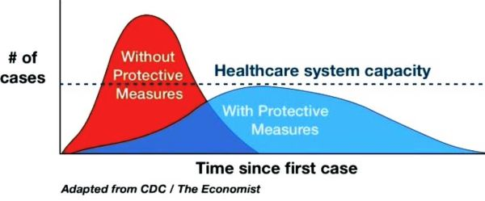
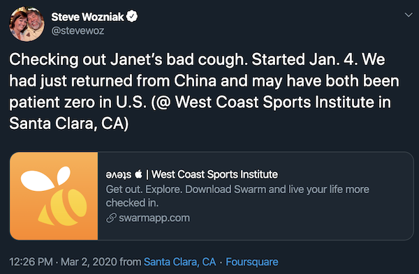
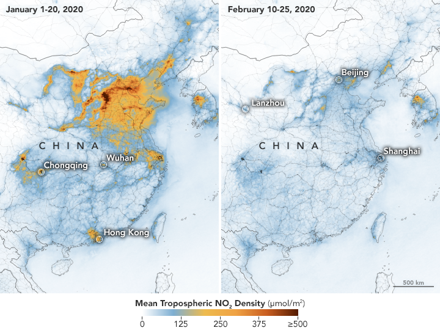
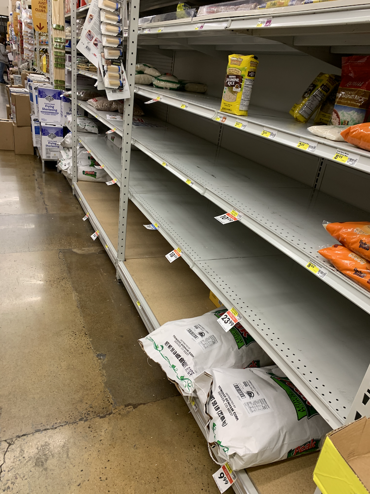

# COVID-19 Journal
My own journal of links, thoughts, and experiences around COVID-19.

## General
Link: [LinkedIn curated list of COVID-19 news](https://www.linkedin.com/feed/news/coronavirus-official-updates-4513283/)

## Mar 7, 2020

I needed a few days away from writing, though I've been spending a considerable amount of time reading and conversing about coronavirus.

Let's start with this:

I suspect this is why my employer -- and many others in this area -- have either mandated or strongly encouraged their employees to work from home. It's an assumption that we'll *all* be coming down with COVID-19 but that it needs to be spread out in order to have sufficient resourcing to keep the business running. 

For me, there are two schools of thought here:
1. Catch coronavirus sooner rather than later, so that if I do need to see a doctor, I can do so before the health system gets overstressed. Not saying that I'd _actively seek out_ to get COVID-19, but that I wouldn't be Howard Hughes paranoid about germs.
1. Go full hermit to push back catching it as long as possible. It would have to be timed so that it's below the dotted line above. This means staying in, not letting the kids have friends over, eating from our stock of food, and probably getting on each other's nerves a lot. The idea here is to give the healthcare system a chance to scale up and/or work through cases, and scientists time to develop a vaccine.

This cannot be contained at this point. US political leaders are either in denial or too stupid to realize this (flip a coin). 

Assorted links from the past few days:
* [Quest Diagnostics to Launch Coronavirus Disease 2019 (COVID-19) Test](https://newsroom.questdiagnostics.com/2020-03-05-Quest-Diagnostics-to-Launch-Coronavirus-Disease-2019-COVID-19-Test). Quest has a large network so this is welcome news.
* [The Lancet: Therapeutic and triage strategies for 2019 novel coronavirus disease in fever clinics](https://www.thelancet.com/journals/lanres/article/PIIS2213-2600(20)30071-0/fulltext). Includes an informative flowchart for triaging patients.
* [Futurism: Coronavirus could force funerals to be livestreamed](https://futurism.com/the-byte/coronavirus-force-funerals-livestreamed). 
* [Stanford Medicine: Stanford Medicine COVID-19 test now in use](https://med.stanford.edu/news/all-news/2020/03/stanford-medicine-COVID-19-test-now-in-use.html). "The Stanford Clinical Virology Laboratory has deployed an in-house diagnostic test for the virus that causes COVID-19. Rapid identification of infected people could help limit the spread of the virus." I also read a few days ago that University of Washington has also been working on a test since December and that it's either available now or would be shortly.
* [San Francisco Chronicle: Coronavirus hits Bay Area: What residents need to know](https://www.sfchronicle.com/bayarea/article/Wuhan-coronavirus-Here-s-what-we-know-15000563.php). The Chronicle dropped the paywall on this article and has been updating it.

## Mar 4, 2020

Definitely an escalation in response today, at least here in the SF Bay Area and in Seattle. 

LinkedIn (my employer) this evening advised that "all Bay Area employees who are in a job that can be done from home should do so through the end of March, unless further guidance is provided." 

A friend in the Seattle area shared this evening that his daughter's school district has closed schools indefinitely. They're going to switch to [Google Classroom](https://classroom.google.com/u/0/). 

Our broken federal government is going to treat it like the Puerto Rico hurricane. This virus will disproportionately impact the most vulnerable among us, who can't afford to take time off from work, or afford to get tested, or even arrange care for their child whose school has been shut down. The school district may do remote classes, but the family might not be able to afford a laptop and Internet to connect.

* [Santa Clara County: 3 new cases, bringing total to 14](https://www.sccgov.org/sites/phd/DiseaseInformation/novel-coronavirus/Pages/known-cases-of-coronavirus.aspx)
* [Los Angeles Times: California declares coronavirus emergency amid worries over Grand Princess cruise ship passengers](https://www.latimes.com/california/story/2020-03-04/los-angeles-county-declares-coronavirus-emergency-6-new-cases). "Gov. Gavin Newsom declared a state of emergency over the novel coronavirus after a California man died after falling ill with the virus while on a cruise ship. Officials are trying to locate hundreds of other Californians who disembarked from the Grand Princess ship in San Francisco last month after a trip to Mexico."
* [WHO: WHO Director-General's opening remarks at the media briefing on COVID-19 - 3 March 2020](https://www.who.int/dg/speeches/detail/who-director-general-s-opening-remarks-at-the-media-briefing-on-covid-19---3-march-2020). "[T]here are some important differences between COVID-19 and influenza... First, COVID-19 does not transmit as efficiently as influenza, from the data we have so far... The second major difference is that COVID-19 causes more severe disease than seasonal influenza... Third, we have vaccines and therapeutics for seasonal flu, but at the moment there is no vaccine and no specific treatment for COVID-19. However, clinical trials of therapeutics are now being done, and more than 20 vaccines are in development."
* [Yahoo News: Banknotes may be spreading coronavirus, World Health Organisation warns](https://news.yahoo.com/who-world-health-organisation-coronavirus-banknotes-warning-111019361.html?soc_src=hl-viewer&soc_trk=fb). Not everyone has the option to use a card.

I take some comfort in the fact that I don't have to worry much about my children getting desperately sick. 

## Mar 3, 2020

"Unusual times."

There was a video circulating around a month ago where drones in China were harassing people who were out during quarantine. The drones had speakers attached and nearby pilots would inform people they should go home, wash their hands, and put on their masks. It was an interesting use of tech -- novel but also a little dystopian. The phrase "these are unusual times" is heard a few times. Maybe it's the translation, but it's a phrase that's stuck with me the past four weeks, and one I find myself uttering to myself more and more.

I woke up not feeling amazing, but the fever was gone and I had no other symptoms, so I went to work. 

* [KRON4: Santa Clara County confirms 2 new coronavirus cases](https://www.kron4.com/news/bay-area/santa-clara-county-confirms-2-new-coronavirus-cases/), bringing the total confirmed to 11. The two new people are in self-quarantine.

* [Buzzfeed: Senators Insist They Will Be Fine During A Coronavirus Outbreak And Won’t Need To Shut Down Congress](https://www.buzzfeednews.com/article/paulmcleod/senate-coronavirus-congress-plan). `‾\_(ツ)_/‾`

* [The Philadelphia Inquirer: The coronavirus seems to be mild in most children, but scientists are not sure why](https://www.inquirer.com/health/coronavirus-children-death-flu-immune-20200219.html). This one's a little older, from Feb 19. It's possible there's newer information out. I'll have to check.

* [Vox: China’s cases of Covid-19 are finally declining. A WHO expert explains why.](https://www.vox.com/2020/3/2/21161067/coronavirus-covid19-china). 

Our internal #coronavirus slack channel exploded today, jumping from ~80 in the morning to ~250 by end of day. As you might imagine, there was lots of chatter there all day.

Coronavirus precautions at work are a mixed bag. "Foot grabs" have magically appeared on restroom doors in the last day or so, which is fine for my building, but less fine for the buildings with latching restroom door handles. There are additional hand sanitizer stations at the entrances to our cafes now, but nobody posted to strongly encourage (or guilt) people into using them. (They could learn some lessons from the cruise industry here, where they're pretty militant about it.) Office supply cabinets have been raided for hand sanitizers. I have some at my desk I used a few times, and I've been focused on not touching my face. 

Lastly, an email went out to all of LinkedIn's ~14,000+ employees late in the evening from our head of HR sharing updates on how the company is managing coronavirus response. Several sales offices around the world are closed out of an abundance of caution, and HR opened the door for people who wish to work from home from now until March 9 (a date which I assume will be extended). 

Unusual times.

## Mar 2, 2020

I woke up at 3am feeling very warm despite us keeping the house at 62F overnight. Sleep was hit-and-miss from there on until I roused the kids at 6:50am. It didn't occur to me to check my temperature until 8:15am or so; I figured I was miserable from bad sleep. Ear thermometer read 100.7 in one ear and 101.1 in the other. I stayed home from work. A mid-afternoon check showed me at 102.1. 

As of 2:45pm, my symptoms are 102.1 fever and very mild joint aches. Breathing seems fine. Sinuses are somewhat caked but not necessarily worse than average for the dry air here. 

Some links from today:
* [Tampa Bay Times: Florida’s first coronavirus cases found in Hillsborough and Manatee counties](https://www.tampabay.com/florida-politics/buzz/2020/03/02/first-patients-in-florida-test-positive-for-coronavirus/). 
* From Twitter, [The CDC has stopped disclosing the number of Americans tested for coronavirus.](https://twitter.com/juddlegum/status/1234536619270688768), which would be concerning.
* [The New Arab: WATCH: Iranian pilgrims taunt coronavirus with ‘communal licking’ of religious shrines despite outbreak](https://www.alaraby.co.uk/english/news/2020/3/1/watch-iran-pilgrims-taunt-coronavirus-by-licking-religious-shrines). Not ideal. 
* From Twitter, [could Steve Wozniak be NorCal patient zero?](https://twitter.com/stevewoz/status/1234575727678435328) 

## Mar 1, 2020

* [ScienceDirect: Harnessing wearable device data to improve state-level real-time surveillance of influenza-like illness in the USA: a population-based study](https://www.sciencedirect.com/science/article/pii/S2589750019302225). tl;dr there's evidence to suggest influenza-like illnesses could be tracked by analyzing resting heart rate and sleep data from FitBit/Apple Watch type devices.
* [Harvard Medical School / Harvard Health Blog: As coronavirus spreads, many questions and some answers](https://www.health.harvard.edu/blog/as-coronavirus-spreads-many-questions-and-some-answers-2020022719004). FAQ and answers from an MD. 
* [NASA: Airborne Nitrogen Dioxide Plummets Over China](https://earthobservatory.nasa.gov/images/146362/airborne-nitrogen-dioxide-plummets-over-china). 

Later in the day:
* [Santa Clara County: Three New Cases of COVID-19 in Santa Clara County](https://www.sccgov.org/sites/phd/news/Pages/three-new-covid-19-cases-3-1-2020.aspx). "The fifth case is an adult woman with chronic health conditions who is hospitalized". "The sixth and seventh cases are a husband and wife. Both are hospitalized, and the husband has chronic health conditions." 
* [Coronavirus Patient and Precautions at UC Davis Medical Center](https://www.ucdavis.edu/news/coronavirus-patient-and-precautions-uc-davis-medical-center/). Looks like UC Davis may have initially missed the first community exposure case in California. They're being a little vague with the language. They don't say when the patient arrived, but then say "Sunday (Feb. 23), the CDC ordered COVID-19 testing of the patient". It's not clear how much time elapsed between when the patient was admitted and the CDC ordered the test, and I haven't dug further. 

## Feb 29, 2020

Picked up a little more food to have around the house, but not to full prepper level or anything. 

Today I'm around 80% confident schools will close either late this week (start date of 3/5 or 3/6) or early next week, either 
through direct action of the CUSD School Board, or indirectly due to unprecedented absences. 

COVID-19 has accelerated locally:
* [Los Altos Town Crier: Coronavirus patient treated at El Camino Hospital](https://www.losaltosonline.com/news/sections/news/61987-coronavirus-victim-treated-at-el-camino-hospital). At ~3.5 miles from our house, this is our nearest hospital, and the one we would go to if needed
* [Bloomberg: First Death Reported in U.S.](https://www.bloomberg.com/news/articles/2020-02-28/germany-boosts-border-checks-google-scraps-event-virus-update). Washington State, man in his 50s. [Edit 3/1/20: this was originally reported as a woman in her 50s.]
* [Palo Alto Online: Fourth case of coronavirus found in Santa Clara County](https://www.paloaltoonline.com/news/2020/02/29/fourth-case-of-coronavirus-found-in-santa-clara-county). "The fourth case involves a woman who is a 'household contact' of the woman who is the county’s third case" and "The woman who is the county’s fourth case is not in the hospital or ill."
* Not news: [Twitter @atrupar: Fox News just interviewed a Pennsylvania man who went through the coronavirus quarantine process -- but he couldn't stop coughing during the interview 😳](https://twitter.com/atrupar/status/1233423437286211585?s=21) -- excellent fathering.

Housewarming party with friends this evening in Santa Clara; while COVID-19 came up in conversation, nobody seemed terribly concerned. 

## Feb 28, 2020

* [CNBC: WHO raises coronavirus threat assessment to its highest level: ‘Wake up. Get ready. This virus may be on its way’](https://www.cnbc.com/2020/02/28/who-raises-risk-assessment-of-coronavirus-to-very-high-at-global-level.html)
* [TheStreet: Apple’s Tim Cook: Our Factories in China Are ‘Getting Back to Normal’](https://www.thestreet.com/investing/apple-tim-cook-chinese-factories-getting-back-to-normal)
* [Stat: Four new coronavirus cases in Pacific Northwest suggest community spread of the disease](https://www.statnews.com/2020/02/28/california-oregon-coronavirus-case-community-spread/). Includes a new case, the second overall, in Santa Clara (CA) county -- where we live
* [KRON4: 2 Palo Alto students sent home after possible exposure to coronavirus](https://www.kron4.com/news/bay-area/2-palo-alto-students-sent-home-after-possible-exposure-to-coronavirus/)
* [Santa Clara County (CA) Public Health: County of Santa Clara Public Health Department Reports Third Case of COVID-19](https://www.sccgov.org/sites/phd/news/Pages/third-novel-coronavirus-case-02-2020.aspx). This "third case had no known exposure to the virus through travel or close contact with a known infected individual"

The above were posted while I was at work. I headed toward home around 6:15pm and stopped at Smart & Final, which 
is a hybrid grocery/warehouse store near the house. Many canned vegetables were picked over, lots of beans still available, 
and most of the bulk bags of rice were gone.

The store was above-average busy, and they had 3 registers going... unusual for this store. 

No actual evidence for this, but my gut tells me Santa Clara County probably went over the tipping point a few days ago 
and we just haven't realized it yet. 

## Feb 27, 2020

Observed on Amazon that [Mountain House freeze dried foods](https://www.amazon.com/stores/node/2596881011?_encoding=UTF8&field-lbr_brands_browse-bin=Mountain%20House&ref_=bl_dp_s_web_2596881011) are now backordered from one to three months. 
