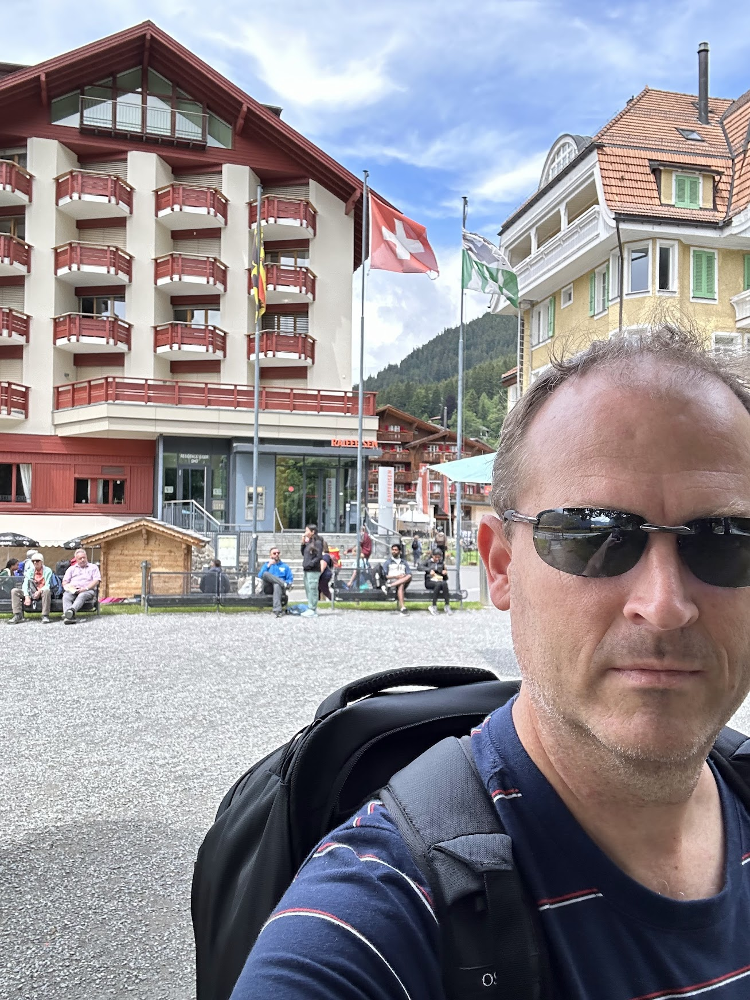
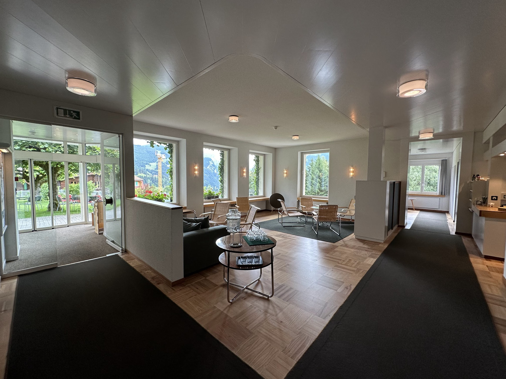
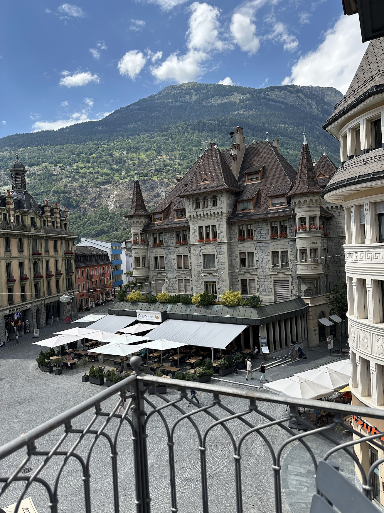

Switzerland Trip - July 10 to 22, 2024
======================================

# Days 0 and 1 
+ **When**: July 10 and 11
+ **Where**: Holly Springs, New York's JFK airport, Zurich

July 10. We begin. Let's call this day 0.

I've been "off" the past two days leading up to the trip. Some of that is attributable to anxiety around a job interview I had the day before I left, but I feel there's also something else at play.

I slept fitfully the night before the trip; Sherri, Rowan, and Siena had to be at the airport around 5:00am. After dropping them off, I tried to sleep again but it didn't take. I comfort-binged some TV, finished my packing, and headed to the airport around 12:30pm. RDU was fine. JFK was fine. Delta has a new lounge at JFK for "Delta One" travelers. It's large, and was quite busy when I arrived around 5:30pm, though I did manage to find a seat toward the back. By 7:30 it had thinned out some. I was feeling run-down during this whole time, and the long part of the trip hadn't even started yet. I dealt with some stomach issues and headed to the boarding gate. After changing gates, we dealt with a ~90 minute delay. I was glad to get to my seat, get settled, and try to grab some sleep. 

I managed around 4 hours, I believe, which wasn't bad for an ~8 hour flight once you factor in takeoff, landing, and meal service. We've landed, and thus begins day 1. 

Zurich airport customs and immigration line was moving well, taking around 10 minutes. Once you exit arrivals, the train station is located adjacent, and also has stores and a food court. The train from Zurich airport to the city center is super easy, and only took 11 minutes. 

I made it to my hotel around 12:30. Check-in is at 2pm sharp, so I left my big backpack with the desk and went for a walk around town. I headed in the general direction of the lake, stopping once for a Coke Zero and then sitting near the Ganymede statute and people-watching for about an hour. Truely, though, I was walking dead and not feeling amazing. I slowly made my way back to the hotel, got to my room, and napped and took it easy until 6:00. After that? More walking! I wanted to head back toward the lake and explore more on the east side. Some dark clouds and thunder rumbling made me rethink that once I was almost at the lake. Note to self: find a good weather radar app. Instead I doubled-back toward my hotel's neighborhood.
Dinner was sushi (kind of) at [this place](https://www.negishi.ch/en/zuerich-pelikanplatz). Tasty, but not all that filling. The NA beer was... ok. I debated treating this meal as an appetizer and making a goal of finding a more 'proper' dinner but ultimately deferred to my waistline and did without. 

It's 11:15pm now. I'm back at the hotel, having showered and readied myself for bed. Not sure what the night holds with respect to my funky sleep schedule. It's possible I end up binging like 3 hours of Parks & Rec and then ultimately pass out and wake up late morning. We'll see.

# Day 2
+ **When**: July 12, 2024
+ **Where**: Zurich

Some days you're just not feeling it, and this was one of those days. 

I dragged myself out of bed around 11, having finally fallen asleep at maybe 4am. Any plans for the day were shot; I just didn't have it in me to explore a church or museum, or find a city hike, or take a boat, or anything really. 

I made myself wander for a while. At [Pret a Manger](https://www.pret.com/en-CH) (which, funny enough, is German owned and headquartered in London) I found a nice salad and ate it there while people-watching. I spent most of the afternoon in the hotel reading and being lazy. For dinner I walked for 30 minutes, peeking at menus and into restaurants, but didn’t like my choices so I ended up at the tapas place at the hotel. It was fine but not nearly as good as the tapas place Don and I found in Basel last year. Around 8 I headed out in the rain for gelato but once I got there it was closed. The closed desert shop coupled with the soggy 20 minute walk back to the hotel put a tidy bow on the day. 

One other note: more often than not jet lag knocks me on my ass. The first 48 hours we were in Iceland last year I was a wreck. Even the second day there I felt like I had a wicked hangover, with none of the drinking. I won't even mention my three trips to India, with that 12 1/2 hour time difference with the SF Bay Area. So knowing this, I thought that Zurich would be a better place to "zone in" before moving on to the touristy towns part of the trip. In retrospect, I wouldn't do it this way again. Instead, I'd take a train directly from Major International Airport to a small town or village somewhere, the kind with one market and six restaurants. I'd get a cozy room with a kitchenette and amazing view and detox there for my first two nights. If there's a hotel with half-board nearby, even better. Living and learning.

# Day 3
+ **When**: July 13, 2024
+ **Where**: Zurich, Interlaken (briefly), Wengen

I actually had a decent nights sleep within normal local hours! Woke up around 8, with a headache, unfortunately. That's not unusual. I wandered over to the train station and had a nice coffee and croissant before my train. My chosen journey today is Zurich -> Bern (stay on) -> Interlaken East (change trains) -> Lauterbrunnen (change trains) -> Wengen. It's around 2 hours 40 mins total. 

One of the busier trains for tourists is this first one from Zurich to Interlaken. Interlaken is a destination on its own, but it’s also a transfer point to major tourist places like Lauterbrunnen and Grindelwald. It was entertaining watching the rail line change the train from platform 31 to 32 for the Interlaken train like 3 mins before it was set to depart. I have to imagine at least a few people weren’t paying attention and got onto the train on Platform 31 anyway. This is the second busiest train I’ve encountered in 3 trips to Switzerland, the first being the one from Grindelwald to Interlaken, when Dad and I were making our unintended, unwelcome visit to Grindelwald after boarding the wrong train at Kleine Scheidegg. 
On the train from Zurich to Interlaken, I managed to find a single person seat on the second level of the train right next to a luggage drop. There’s a man in a bright red shirt who is the spitting image of Bob Odenkirk in a red shirt down the way from me. 

Since we'd arrive in Interlaken around lunchtime, I hatched a bright scheme. My train tickets didn't specify exact times, so I made a plan to get off in Interlaken, stash my stuff, grab a casual lunch, have a walk along Lake Brienz (one of the two Laken's that the town is Inter), and then hop on a later train. The train to Lauterbrunnen runs every half hour so I'd have flexibility in continuing my journey.

My plan was immediately foiled by all the train station lockers being full. Since I wasn't down for a leisurely lake stroll with two backpacks, I instead grabbed a pasta salad at the grocery and scarfed it down so I could catch the next train to Lauterbrunnen.

I loved these salads:

The Lauterbrunnen station needs to be, like, 30% bigger. It's workable, but could be better. Thankfully they seem to coordinate the times between the arriving Interlaken train and the departing Wengen train, so you simply have to walk across the platform and there you are. 

It was great being back in Wengen:

I made it to [Hotel Alpenruhe](https://www.alpenruhe-wengen.ch/) right at 2:30 and thankfully my room was ready. The rest of the day consisted of grabbing snacks at the grocery, a beautiful (if cloudy) ~2 mile hike, a very satisfying steak dinner, and an after-dinner stroll around Wengen. Now here in front of the hotel writing on my laptop and swatting flies.
Today is the first day I actually feel normal.

This ridiculous view from my hotel would actually get _better_ tomorrow:

The hotel lobby was nice:

Dinner:

# Day 4
+ **When**: **July 14, 2024**
+ **Where**: Wengen

I'll start off by trying to answer a question a friend posed to me last evening:

_Why Switzerland? Weren't you just there?_

Good question. There are many places in the world, and this is my third visit in 5 years.
The quick answer is that it's probably a few things. The parts of Switzerland I've been to are relatively clean, safe, and organized. It has mountains (I grew up in Florida). I like practicing the tiny bit of German I know. The trains and trams are easy. At this point I'm comfortable with getting around Switzerland, so there's less travel friction to deal with than, say, India or Japan. I foresee a future post that explores this question more in a more general way. Or, put another way, I think I'm seeking a certain lifestyle that isn't necessarily Swiss but that the Swiss happen to practice.

On to today's activities:
This is what I woke up to at 5:58am:

This was from my balcony. Insane. I pondered the mountains until 7:30, then headed down for breakfast. It was brief, though: the weather forecast only showed sun for the morning, with clouds in the afternoon, so I had to get moving. I did a repeat of the Panorama trail from Mannlichen to Kleine Scheidegg that me and dad did last year, taking the cable car up at 8:30, making sure to use my Swiss Half Fare card (more on this later). 

At the top of Mannlichen:

Midway:

The weather was clear and I had ridiculous views for the hike down. Once I made it to the Kleine Scheidegg train station I debated hiking down further. The train has a few smaller stops it makes on its way to the main station at Wengen.  It would've been a 3100ft elevation drop to go all the way to Wengen. The quad buster! I took the train instead. 

I grabbed another to-go salad from the Coop market next to the train station and hiked it back up to my hotel. My lunch view was outstanding:

For the afternoon I set out to explore Mürren, which lies on the opposite ridge of the Lauterbrunnen valley from Wengen. For my trip last year I had planned to stay at either Wengen or Mürren and it was basically a coin flip that I chose Wengen. Having traveled to Mürren today, I can say I 100% made the right choice. 

To get to Mürren, you have to take a cable car up to a stop called Grütschalp and then transfer to a train to take you the rest of the way to Mürren. That cable car kind of sucks. Yes, it's a fast way to get up the mountain, but the station looks kind of dingy, the staff aren't doing what they're supposed to for crowd control, and then in the cable car itself we were packed like sardines. And then you get to repeat the process, including the poor crowd control, on the way down. Possibly with luggage.

Mürren itself is closer to the end of the valley, so the views are pretty spectacular. But the town is long and thin and didn't feel much like a cohesive town to me. Perhaps Wengen has spoiled me. There are a few hikes that you can take from Mürren but I again decided not to overdo it. I opted for a casual 2.8 mile hike from Mürren back down to Grütschalp that runs along the train tracks for much of the way. When it does veer into the woods, it's amazing. Beautiful alpine trees, waterfalls, and the tinkle of cowbells in the distance. 

I was glad I didn't try for anything more ambitious, as the muscles on the front of my shins (Tibialis Anterior) were really feeling the burn toward the end. I ended up savoring the brief uphill bits of this climb, as it used different muscles! With the hike over I took the cursed cable back down to Lauterbrunnen. I walked along the main drag of Lauterbrunnen for a little bit but I wasn't feeling it. It has a similar long + thin arrangement as Mürren and, to me, feels more like a waypoint to other places than a destination itself. So back up to Wengen and my hotel.

That's mostly it for today. I had an OK dinner in Wengen at Pasta and More, a schnitzel that was a little tough but got the job done. To let dinner settle, I did the same stroll around the back of town as the previous night. 

# Day 5
+ **When**: July 15, 2024
+ **Where**: Wengen, Brig

Good morning!

Moving day. If I end up sick, it’s likely because of the woman sitting tandem to me on the Lauterbrunnen to Interlaken train. She has that “meaty” cough. Mask? No. After a few minutes I moved over to the separate area of the train car where people get on and off and idled there for the remaining 20 mins of the ride. We'll see. 

The train route today was Wengen -> Lauterbrunnen -> Interlaken Ost -> Spiez -> Brig. WIth the point-to-point train tickets (unless you buy a SuperSaver reduced fare), you just have to use the ticket that day and make sure your voyage takes the purchased route. For example, there were two different routes from Spiez to Brig, so I needed to ensure I hopped on a train that got there via Lötschberg-Basistunnel. Not a problem since those come frequently _and_ they take like 30 mins instead of over an hour. 

Given all that, plus that I couldn't get into my hotel in Brig until after 3, I had some midday time to kill. I hopped off at Spiez, which is on Lake Thun, one of the two lakes that Interlaken is "inter". It's gorgeous.

The train station and shops are up a hill a bit from the lake. I was feeling pretty warm by the time I made it down to the lake, and that was heading downhill. There was probably at least a -10 degree temperature difference down there, absolutely perfect. There's a lakefront walk called the Strangweg that goes for a long, long way. I did about 20 minutes and then had a nice sit and watched the goings-on on the lake. The fronts of my shins continue to bother me, so even flat walks I have to take a bit slower. After the walk I made my way back up the hill to Migros cafeteria for the most overpriced meal I've had in my life. But the view was tops and it let me kill time before catching my train. I intentionally chose a later train (2 of mine passed while I was at the cafeteria). One was showing as super crowded, which, to be fair, wouldn't have been a major inconvenience for a 30 minute train trip -- I've certainly done worse on Caltrain -- but the optimal one was the 2:42 which placed me in Brig at 3:11, shortly after check-in time at my hotel. Perfect. 

My hotel in Brig, [Hotel de Londres](https://www.hotel-delondres.ch/) is an easy ~500 meters walk from the train station, a very slight uphill but super reasonable compared to Wengen! Frankly, I'm enjoying these boutique, mom and pop hotels. The staff is SO nice, there are amenities like lounging areas and Honor Bars, and twice now while hanging out in a lobby have I been asked to flip the lights off when I head to bed as the office staff is going off duty. 

I booked a neat balcony room that faces a small public square with two restaurants. It's not nearly as noisy as I expected. Since my balcony is facing south, it was screaming hot out there when I arrived. One the sun went down and the temperature dropped to around 68, it was perfect out on the balcony. 

Dinner was a nearby sushi place. It wasn't great but at least it was fast and they were very friendly. 

Late evening, around 11pm. I have the three windows cracked, there's a light rain, and I'm feeling optimistic for a solid sleep tonight. Tomorrow I'll head on the train to Mörel, around 30 mins away, then cable car up to Riederalp at ~6100 ft. From there I'll launch off on a "Casselweg themed trail around the Riederhorn", which is 6.2km with 219m of ascent and the same descent: [trail](https://www.aletscharena.ch/en/activities/tour/casselweg-themed-trail-around-the-riederhorn). The vertical ascent for the PG&E Trail at Rancho San Antonio Park in Cupertino is around 300m, so I'm feeling comfortable with the 219m. My ideal scenario for tomorrow is to get an early start and have that hike knocked out by lunchtime. Then there are a few traditional Swiss restaurants in Riederalp on my radar. I do hope the front of my shins hold out, especially on the downhills. 

# Day 6
+ **When**: July 16, 2024
+ **Where**: Brig

I slept from midnight to 7 but at no point on this trip have I greeted the morning feeling what I'd call refreshed. It's more that I will myself to start feeling good. Truly I don't know if my CPAP machine is helping or hurting me. I'd say there's a non-zero chance that the pressure setting is wrong and it's not blowing enough air or moisture. 

Had a light breakfast at the hotel, then set out to Riederalp for hiking and sightseeing. It's an easy train trip from Brig to Mörel, something like 9 or 11 minutes, and then a gondola ride up to Riederalp West. Riederalp is another one of those Swiss towns perched halfway up a mountain, where cars aren't allowed. Love it. It also seems to have some awesome skiing come winter. 

I hiked more than I had planned to. As mentioned yesterday, I initially set out to do something called the Casselweg. I hiked up from the gondola station to where that loop would've started but then noticed a different scenic trail to a place called Hohfluh. So far I'd logged ~450 feet in elevation gain, and this segment from Riederfurka and Hohfluh would add another 650, for 1100 gain total. A lot of the hike was like this:

Eventually the clouds opened up some once I made it to Hohfluh, so I enjoyed the glacier view from there. 

Hohfluh has a ski lift that I could've taken back down (my front shin muscles are still **shot** from previous days), but then I noticed another lift and viewpoint off in the distance, called Moosfluh. ChatGPT, which has truly been _extremely_ helpful in planning these hikes, tells me it's another 348 feet of vertical and 1.9 miles of ground distance. That's do-able. 

The last 1/4 of this bit is pretty rough, so I arrive at the top pretty whipped. But: I have a huge expanse of the Aletsch Glacier in front of me. It's stunning. It looks like a river of ice and snow. 

I perch on a bench for half an hour or so, recovering from the hike(s) and savoring the view. Then I take the gondola back down to Riederalp. I grab a prosciutto pizza at a restaurant next to the lift (plus a chocolate ice cream) and then meander back across town to catch the Riederalp West lift back down to Mörel. I miss my train by 20 seconds. I wait 30 minutes for the next one. 

For dinner I wandered up and down the main street looking at menus, then settled on [Restaurant Augenblick](https://www.restaurant-augenblick.ch/) across from the train station, which was fine. Afterward I camped in the hotel's "living room" and worked on my journal.

# Day 7
+ **When**: July 17, 2024
+ **Where**: Brig, Zermatt

Today was the move to Zermatt. I chose an early start leaving Brig, since the weather forecast for Zermatt showed clear skies. There was severe flooding around 3 weeks ago in the Zermatt area and as a result the rail line is closed along part of the route. The routing, then, was train from Brig to Visp, ride a touring bus from Visp to Täsch (the train stop before Zermatt), then board a train for the last leg. I think the trip ended up being around 90 minutes total, if I recall. In Visp I take a moment to chat with one of the people directing travelers onto buses. "Which bus would you take?" She smiles and points to one of the nicer 2 story touring buses. That was a win, as I see other people boarding a less comfortable city bus for the trip through the mountains.

Once I made it to Zermatt, I found lockers under the train station and stashed my big bag. I'd scoped out a hike called the Gourmet Trail. It starts at the top of the Sunnegga Blauherd Rothhorn Funnicular...

... and ends back in Zermatt. It's called the Gourmet Trail due to multiple restaurants along the way, though several of them were closed during my hike. I'd say the first 1/4 of the trail is uncomfortably down, the middle half is a flat walk through a gorgeous forest, and the last 1/4 is walking downhill on a well-maintained road. 

The first half of the trail features gorgeous views of the Matterhorn. Today the very top was obscured by clouds but it was still incredible to be able to glance up and see this iconic sight. There's almost no tree cover for the first 1/4, also, so sunscreen was essential. Overall I've been fortunate in that my sunscreen is doing what it's supposed to, even on my head. 

Mid=-trail was wooded, and I so loved this part of the hike through the trees:

One of the stops along this "Gourmet Trail":

Back in town after the hike, I started to search for lunch places but it was looking like it would be a $40+ meal. Instead I went to the Coop and got my good old arugula/mozzarella/tomato/pasta salad (though I forgot to grab the salad dressing) and camped on a train station bench. Afterwards, I grabbed my bag from the locker and hoofed it across town (and slightly uphill) to my hotel, where fortunately I could get in before the official check-in time. 

Hotel Tannenhof is new and nice. It's the kind where the room doesn't wake up until you put your keycard into a little holder by the door.  The room is comfortable and clean and has a balcony that could probably seat six. Speaking of the balcony, I was checking out all the angles, and I'm pretty sure that if my balcony were about 10-15 feet further north that I'd have a direct view of the Matterhorn instead. Oh well.

I read on the balcony until a reasonable hour for dinner, and ended up at a place called the Derby. After the hike today I wanted protein so I opted for the Entrecǒte. It was fine. I'm at the point where I'd like to get a big juicy ribeye even though it would probably cost $60. 

After dinner I went for a stroll and had a nice catchup Facetime with Sherri while I sat by the church. This was my view during that Facetime, which isn't bad.

I thought I'd get gelato across from the church but the line was out of control, so I chilled at the hotel. I set back out again a little after 10 for another stroll to check out nightlife. I didn't wander long; seeing people out and about, enjoying time together in the bars and restaurants, made me feel lonely and homesick. I went back to the hotel to stay in for the night.

The hike today was incredible. Top 5 for sure. Maybe even top 3. The section of the trail that passes through the woods gave me such peace and joy. I don't understand this part of my wiring. But also, Zermatt is where I've felt the most acute loneliness so far on this trip. In a city like Zurich, you see lots of other people by themselves, going place to place or sitting my the river while they live their life. In Wengen, it's a small village, and there were a lot of families there doing family activities, which you would think would make be feel isolated, but somehow didn't. Brig was somewhere in the middle. There I ate two dinners at two different places and didn't feel out of place, as there were others doing the same. 
Zermatt, though, is set up for wealthy tourists: there were some families with kids,  saw some younger couples, but LOTS of older people who appeared to be friend groups. Lots of people in groups, walking together, eating together, window-shopping together, laughing and having fun. It's the lowest I've felt this whole trip, at a time when I'm surrounded by so much natural beauty. I really really really need to figure out how to do a trip like this with my family or travel friends. I have some doubts that I could be happy doing this solo again knowing what I know. 

Lastly before I wrap this entry: I am fully away of the privilege of being able to come on a trip like this. It requires time away from work, a certain financial position, and an understanding family. I feel profoundly grateful to be here, but I fully recognize there's a lot of room for improvement in my own mental well-being. If I can't be happy somewhere amazing like this, where can I be happy?

# Day 8
+ **When**: July 18, 2024
+ **Where**: Zermatt

Starting the day with breakfast at the hotel:

And then: another hike! What else? This one was called [Afternoon hike at Nature Trail: Riffelalp - Sunegga](https://www.alltrails.com/explore/recording/afternoon-hike-at-nature-trail-riffelalp-sunegga-53c5b2a). I had it in mind that I'd take a train up higher than yesterday, hike down to the top of the same funicular (Sunegga), and then from there I'd rent one of those kickbikes and shoot down to town that way. Without all the leg and knee hurt. The hike starts well above Sunnegga, so most of the way is down, except for the last mile or so, which is Very Up. It was an overall fun hike, with incredible views of a (clear) Matterhorn, as well as a few lake stops. 

The uppermost lake of the hike, Grünsee, sits at 7500ft and is ice cold as you might expect. Despite the frigid water temp, there were a few kids swimming in it, because kids. 

I was beat by the time I made it to Sunnega and wasn't really feeling kickbike at that point. I had a pricy buffet lunch there at the top (I know, you're paying for the view), then rode the funicular back down. 

As the hike progressed, I started to dwell more on not having a place to stay starting tomorrow. Zermatt's not transportationally close to anything, so I knew I had to make it out of the valley. But from there, choices were wide open. I still wanted a smaller town or village, which removed places like Lausanne, Basel, and Bern from consideration, even though they would've been convenient to get to. I didn't want to overdo it on Lauterbrunnen valley or the Interlaken area, so Grindelwald, Mürren, and Interlaken itself were out. I briefly considered Spiez but I wanted more of an alpine vibe. Ultimately I ended up setting some parameters on booking.com (e.g. 1 person, July 19-21, rating 8+, actually available) and that reduced my choices considerably. I panned through the valley I'd been in before Zermatt, where Brig is located, and happened upon Riederalp and Bettmeralp. Riederalp is where I took my glacier hike from, and was nice. Bettmeralp is the next town up the valley and also located up the hill. It's a no-car village that requires a cable car to reach. There was one room left, at Hotel Waldhaus next to the lift station. Perfect. Book it. 

That was a huge load off! I read on my kick-ass balcony at the Tannenhof for awhile, had a shower, then set out in Zermatt to find dinner. I think I walked up and down the main street, from the train station all the way past the main church, at least three times, inspecting menus and my own feelings. I had a fine meal at Derby the night before, and it truly wasn't a problem eating alone, but tonight I didn't want to sit by myself in a crowded restaurant. I made my way back to my hotel and ate in their restaurant Golden Lok. I knew it wouldn't be crowded but it's not because of quality of food or service -- both were excellent! I had spaghetti with clams. The restaurant: [Golden Lok](https://goldenlok.ch/)

After dinner I hit up that super popular gelato place around the corner, luckily minutes after they'd opened at 8pm, and sat outside the church and enjoyed the view of the Matterhorn. Then, some Parks & Rec on my laptop, and sleep.

# Day 9
+ **When**: July 19, 2024
+ **Where**: Zermatt, Bettmeralp

Time to move again. With the train problems between Zermatt and Täsch (pronounced Tish, I found out), I knew the first part of the day would be organized chaos. Recall from my previous post:  it's train from Zermatt to Täsch, bus transfer from Täsch to Visp, and then train to wherever you're going from there. All in all it wasn't too bad, and there are worse things than taking bus or train trips through Swiss valleys.

I knew I wanted to give my legs a chance to recover today; the first Zermatt hike wiped out my Going Downhill muscles and yesterday's took out my Going Uphill ones. I've been conscious of NOT damaging my muscles and putting myself out of commission. This happened on my first trip to Switzerland, when I hiked down from Harder Kulm in Interlaken, which was ~2400 feet. Worse, I was pushing harder than I should've been, since I'd purchased a 2pm SuperSaver train ticket. This killed any sort of hiking activity for the rest of that trip, since even stepping off a curb hurt!

I made my way via trains, bus, and cable car to the top of Bettmeralp.

 

Fortunately my room was ready at 12:30. 

I took my time settling in to my room, then strolled up the main street to peer at lunch menus. I enjoyed one of the **BEST** roast beef sandwiches I've ever had, on the terrace of a restaurant named Alpina. It was roast beef, coleslaw, and a thin-ish slice of parmesan cheese, with some sort of sauce. The fries were excellent, too, but that's kind of standard for Switzerland I've found. 

Walking back from lunch I made my now-obligatory stop at Coop and bought my chocolate crackers and a Coke Zero. The rest of the afternoon was me doing everything in my power not to hop on a lift or go on a hike. I caught up on yesterday's journal entry, started on today's, and followed the global Crowdstrike IT issue that was causing Windows machines to have problems. In that regard today was a good day for not working in corporate IT anymore. 

Tomorrow I'll revisit the Aletsch glacier, this time closer up the valley to it. I didn't set out to find this glacier the first time I visited Riederalp. It sounds insane, but I was hiking and literally just happened upon it. Tomorrow I'm looking for a decent hiking trail near me and it just so happens to be even closer to the glacier, with better views. I keep stumbling into fun things on this trip.

I looked back through some of my previous entries and I'm happy to report that the coughing woman on the Lauterbrunnen train did not make me sick. Possibly moving seats halfway through helped. We'll never know. My comments from day 7 regarding loneliness still stand. The older I've become, the more convinced I've become that it's the people that matter, not the places. And right now I have places but not people. 

This is the place that had the kick-ass sandwich: [Alpina](https://maps.app.goo.gl/4g19we1rnaivVoHn6?g_st=com.google.maps.preview.copy)

# Day 10
+ **When**: July 20, 2024
+ **Where**: Bettmeralp

I'd planned for a less intense day today. I'm not sunburned but maybe... sun-stressed? I figured my skin and legs could use a lighter day today. I slept in late, then got moving around 9:30. I took the gondola up from Bettmeralp to Bettmergrat. This is right near some incredible viewing spots for the Aletsch glacier. Looking at the map, I really only see one other closer viewing point connected by a lift, and that's at Eggishorn. 

It's almost criminal, I know, but I only spent about 20 minutes up at the top. It was somewhat crowded, and I'd had lots of opportunities during my Riederalp visit to take in the glacier. 

I took the gondola back down, then meandered my way back to Hotel Waldhaus. Most of the day, then, was spent at the hotel, relaxing and reading. 

I did manage to make accommodation plans for tomorrow night, which will be my last stop in Switzerland. Staying in Zurich would be the easiest logistically, but then I remembered how out of place I felt there at the beginning of the trip. Sure, some of that could've been jet lag and travel anxiety, but ideally I'd find a smaller town, somewhere between here and Zurich. I decided on Thun (pronounced 'toon'), which sits on the shore of Lake Thun, one of the two Interlaken lakes. It has around 43,000 people. It'll take around 1h 45m to get from Bettmeralp to there. Then, on Monday, it's around 1h 40m to go from Thun to Zurich airport. There's even an 8:34am train where I don't have to transfer, so I'll be targeting that one. So anyway, that's my final plan locked in.

Late in the afternoon I walked over to Riederalp. Fortunately it's mostly flat. I stopped at [Restaurant Bergdohle Riederalp](https://restaurantguru.com/Restaurant-Bergdohle-Riederalp-Riederalp) again and had another pizza. Besides salads from the Coop grocery store it's the only time I've eaten at the same place twice during this trip. I made a casual stroll back to Bettmeralp. 

It's 8pm now as I'm wrapping up this journal entry. I may make one more stroll through town and then read in my room. 

# Day 11
+ **When**: July 21, 2024
+ **Where**: Bettmeralp, Thun

Managed 9 and a half hours of sleep according to my CPAP. I needed catching up, apparently.

Today I wrap up my stay at the lovely Hotel Waldhaus in Bettermalp and make my way to Thun, as I work my way closer to Zurich and my departure airport. 

The train rides were uneventful, just like we want it. After some difficulty locating the front door to my hotel, I tried to check in but in this case my room wasn't ready early. No problem. I dropped by main backpack and headed out to explore Thun:

Dominating the view over Thun is [Schloss Thun](https://schlossthun.ch/en/) (or Thun Castle); it seemed like an obvious destination. I made my way up the hill, paid my entrance fee, and took my time inside the Schloss, enjoying their exhibits and air conditioning. 

After 3 I made my way back down the hill and checked in to the [Hotel Krone Thun](https://en.krone-thun.ch/). My room was large, easily the largest of the trip, and abutted the walkway next to the Aare river that runs through town. After all the walking and Schlossing, I relaxed for a few hours in the room. In early evening I headed back out again to sightsee and rustle up some food.

Thun has a different vibe than the other Swiss cities I've been to. I can't quite put my finger on it but it's more of a locals feel, or more of a Swiss tourists feel rather than international tourists. Not sure. It wasn't *bad* vibes just different vibes. Anyway, I did my now-usual peer-at-restaurants-and-then-end-up-next-door-to-the-hotel, which was fine as there was an Indian restaurant right around the corner. After that, more strolling with gelato in hand, then back to hotel for my last night in Switzerland.

# Day 12
+ **When**: July 22, 2024
+ **Where**: Thun, Zurich, NYC JFK airport, home

I slept *horribly* last night, I think from 1:30am to 6am. While the room here at Hotel Krone Thun is nice, the bed is the least comfortable in my time here in Switzerland. I could've blamed it on anxiety about today's travel and my early train, but an 8:30am train isn't *that* early. 

The trip was 1h 45m, no problems. I chose a train route that didn't require me to switch at the Zurich main station (not that there aren't trains between there and the airport every 3 minutes). These were my choices:

Zurich Airport was very busy, though people seemed aware of their surroundings and things flowed. Past security the airport has a *giant* outside observation deck where I would've loved to kill some time, but the rain drove me back indoors and I hunkered at my gate instead.

The flight was average. My seat was broken, which I only figured out part-way through the flight when I tried to raise it back up to eat and it wouldn't move. The Delta A330 business class seats are not good, and the entertainment system felt like it was 15 years old. Flight attendant Eva was extremely helpful in trying to troubleshoot the issue and then helping me move to a working seat. 

Global Entry has an app that will take your photo, but I’m fuzzy on whether that means you don’t then need to use the face scan kiosks? Anyway, as soon as we landed at JFK I did my Global Entry photo, which is good for 60 minutes. Between waiting for a gate, taxiiing, and a half mile walk, I made it with 6 mins left. As usual, Global Entry meant I waited less than 60 seconds to make it past passport control. 

I went back to the Delta One lounge here at JFK, which was much less busy this time than last. My connection wasn't scheduled to be very long, maybe 90 minutes, so I ate a dinner and then continued over to my gate only to find out my RDU flight was delayed waiting on crew. We pushed back around 45 minutes late, and then taxied for another 45 mins before taking off. Then we did that thing where we cruised at 6,000 ft most of the way to Raleigh, presumably to avoid weather or ATC problems… or both. I've done this low-flying thing before when coming back from Newark. It's interesting flying so low but it makes the flight at least 1.5x longer, and it'd already been a long day that started with bad sleep in Thun, Switzerland. It's not a complaint, as I realize the alternative is waiting on the ground at JFK for weather and traffic to clear; I'd much rather be on the move.

That's it! Safely back at home, doing laundry and fighting jet lag.