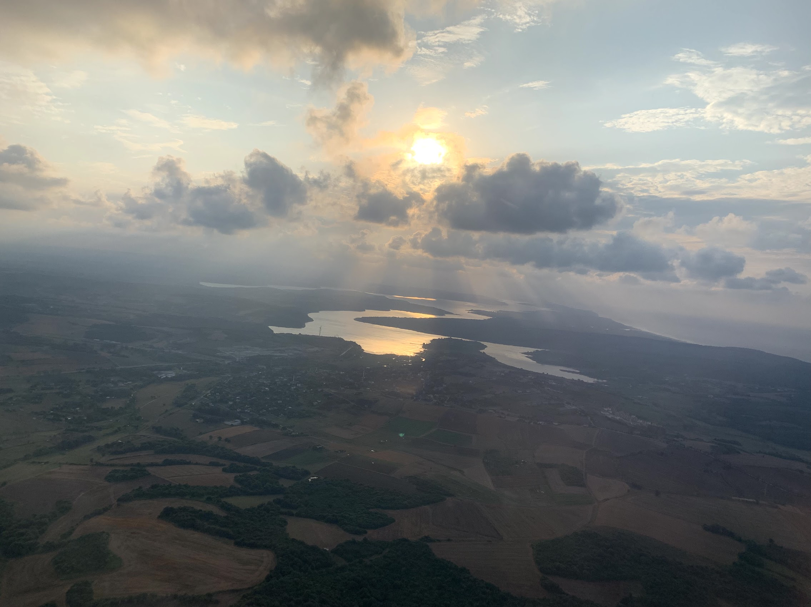
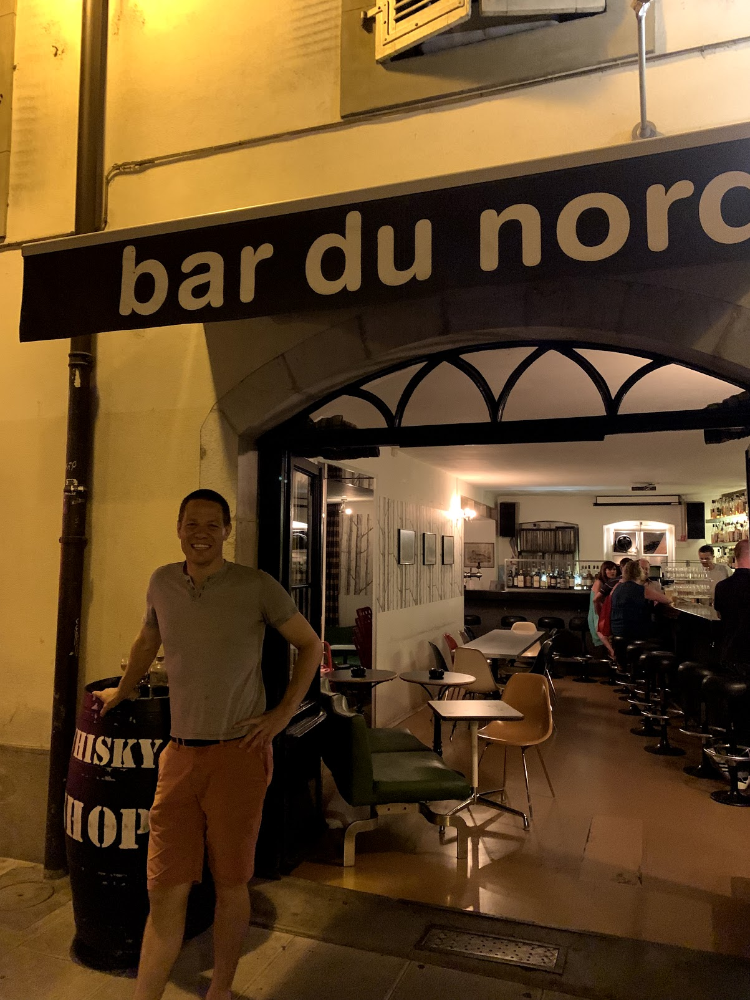
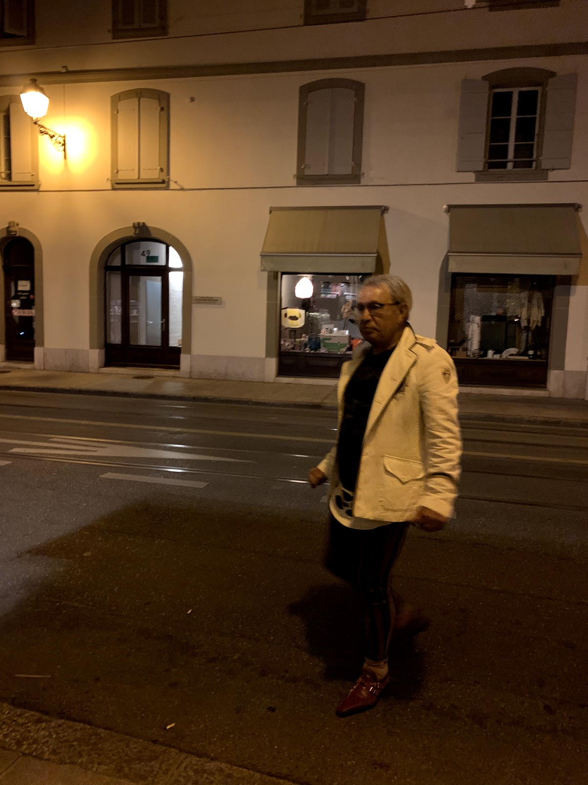

# Switzerland trip
From travels to Switzerland and France in June and July of 2019. This 
was a personal, solo trip during LinkedIn break and while my wife and 
kids were in Canada for the summer with relatives.

I booked the trip in January 2019 after researching a bunch of other 
options. Switzerland had the right combination of 1) someone I know 
lives here, 2) not likely to be sweltering hot (lol! see below), 
3) relatively  easy to get to other places nearby, 4) found a decent deal 
on a business class plane ticket, and 5) different enough from the US but 
not so different that language or culture differences would cause a
lot of friction.

Not planning on a day-to-day recap in this post, but so that I have
a fighting chance of remembering where I went and what I did later:
- Day 1 (Friday): arrive, whiskey with Joshua
- Day 2 (Saturday): touring around Geneva. Street food festival, Carouge farmers
  market, UN Club (beach) in the evening with friends
- Day 3 (Sunday): more touring around Geneva. Street food festival again,
  Bains des Pâquis, walking around the old town
- Day 4 (Monday): rental car fuckery, Alpybus to Chamonix, walk from Hôtel Mercure 
  Chamonix Les Bossons into town, wicked thunderstorm.
- Day 5 (Tuesday): move from Hôtel Mercure to Heliopic, Aiguille du Midi, 
  caught in the rain coming back from dinner. 
- Day 6 (Wednesday): Chamonix to Geneva (9 euro swisstours bus), train to interlaken,
  Hotel Lötschberg, Italian place across from mall.
- Day 7 (Thursday): up to Harder Kulm on Harderbahn, hike down (in a time crunch),
  trains back to Geneva.
- Day 8 (Friday): CERN, dinner with Joshua and Max, tomato festival
- Day 9 (Saturday): 

## Itinerary
For reference, the only pre-planned arrangements were:
- Fly to Geneva (via Istanbul) on June 27, arriving June 28
- Stay for first two nights somewhere in Geneva to recover from jetlag
- Fly back to the States from Geneva on July 7

My intention was to keep my arrangements pretty flexible so I could 
go-with-the-flow and stay extra time in places that interested me and 
move along if they didn't. That plan _sort of_ worked; more on that 
below.

## Getting Here
I took two flights, both on Turkish Airlines: a 13 hour from SFO to 
Istanbul, and a 3 1/2 further flight to Geneva. 

The SFO flight landed around 5pm and the Geneva flight was scheduled 
for around 7pm. 

Istanbul built a 
[new airport](https://www.youtube.com/watch?v=Ju6FJ8qRTtk) they're 
very proud of. It's... giant. High, vaulting ceilings and so much 
space. The business lounge was comically difficult to find but 
otherwise the signage was good. It was a very long walk to my gate. 
As far as I could tell they only had those squatting toilets and I 
wasn't in any condition to give that a go. I can't imagine they don't 
have Western-style toilets around with all the Westerners transiting 
the airport. If they truly don't then it's a giant fucking oversight. 
I was too tired to investigate 
further, and language was a challenge. 

There are a lot of
"fit-and-finish" type issues with the airport where it looks like 
it was a rush job at the end or they don't have enough maintenance 
staff -- cracked tiles, dirt along edges of wall, carpet misaligned,
shoddy caulking in the bathroom. The airport overall, though, is a 
feat of engineering.

The Istanbul to Geneva flight was uneventful. I did manage to 
snap this photo shortly after departure:

Arriving in Geneva was a breeze. I feel like my whole time in the 
airport took maybe 15 minutes...? That includes passing through 
passport control, getting my bag, and finding a taxi. 

Met up with friend Joshua (who lives across the street from my hotel) for
some whiskey and catching up:

Where we came across this well-dressed angry guy:

There was a lot of arguing in French between him and the whiskey bar 
proprietors, with them throwing a bucket of water at his feet (but not on) 
as ultimate insult of some sort. He wandered off after a few minutes. ¯\\_(ツ)_/¯

## Geneva Airport

Let's talk for a minute about the Geneva airport. It's situated right on the 
Switzerland-France border. The airport proper appears to be completely on 
the Swiss side (when eyeballing the map), but there is a French sector of the 
airport and Swiss sector. You land on the Swiss side; if you're arriving 
on a flight from a French city, you have the option of exiting directly into 
the French sector, and all other passengers must exit on the Swiss side.

So far so good?

You may not know this Swiss/French distiction beforehand, so when you rent 
a car online, you might put in "Show me cars to rent at Geneva airport", 
a bunch of results pop up, and you do your shopping. You can rent cars on either 
the Swiss or French side, but the rental car sites don't make it abundantly 
clear which side you're renting from, and if you don't know to look for it... well. 
Anyway, when you arrive from your international flight, 
you then proceed to either the rental car desks in the Swiss side, or you 
first transit to the French side by showing your same-day boarding pass. 

The problems arise when, like me, you've been in Geneva for a few days and 
then decide to rent a car at the airport because it's cheaper than renting 
one in the city. I found an affordable rental at The Airport, shlepped over 
there (one 20 minute light-rail trip, one 9 minute train trip) with my 
stuff, and made a few discoveries. 

One, there's no information on whether 
you go directly over to the rental car garage, or if you need to stop at 
the rental car desk in the terminal first. Turns out I needed to stop by 
the Thrifty desk at the terminal first, I found out after taking the bus over
to the rental car garage. 

Two, the rental car garage is literally like 200 yards from the terminal, so 
I did a lot of waiting for something I could've easily walked.

Three, as mentioned, there are two sectors to the airport, and I had a 
reservation for the wrong side, and they wouldn't let me across as I 
didn't have a *same day* boarding pass. (I hadn't just arrived by plane.)

Four, there's no great way to get over to the French sector if you're denied. 
One airport worker declared it _impossible_, while another said that I could 
perhaps find a taxi to take me over (?) but seemed unsure. 

Five, lease surprising, it's really fucking expensive to rent a car same-day. 
Hertz and Avis were quoting me something like $120 USD/day, Eurocar didn't 
have any, and Sixt's systems went down everywhere just before I arrived (which 
I believed, as they started turning away other comers, too). 

So I bailed on the car. There was no penalty to canceling my reservation (which was 
sitting on the French side), and there were other trnasport options. I knew I had to 
make it to Chamonix or lose my hotel room, so I booked an [AlpyBus](https://alpybus.com/) 
ticket (either 35 Sfr or Euro) that left in 30 minutes. It had the advantages of being 
airport-to-hotel service, which freed up some logistical overhead once in 
Chamonix, and plus it gave me the opportunity to actually enjoy the trip over 
instead of worrying about driving. 

## Logistics

As mentioned above, my plan was to keep arrangements flexible so I could
call audibles along the way and go where my desires took me. This ended 
up being hard to achieve, and caused more friction than benefit. 

It meant that instead of spending mid-days doing activities, I was 
in-transit between hotels instead. And while hotels will store your 
bags for you, the gap between 11am checkout and 4pm check-in meant I 
didn't have a place to crash out during those hours if I wanted to. 

I was spending at least an hour a day planning for the next day. What town would I 
go to? How would I get there? Are there trains? What times? What about hotels? 
How do the reviews look? Is it a relatively decent price for the quality of the hotel? 
Is the hotel near the train station? If not, what does the bus system look like 
there? Are the activities near the hotel, since I'll need to drop my bags? Or 
should I book a different hotel that's closer to things to do but further from 
the train station? Etc etc etc. I get that sometimes you have to say fuck it and 
click the Book Now button, but I wanted to at least make educated choices. 

Day 6 -- Wednesday evening --I reached my limit for the daily planning exercise while 
in my Interlaken hotel room. Working through the questions above, I decided to trim 
down the daily logistical chore by heading back to Geneva. From there, I'd have 
a home base in a hotel I was familiar with and was affordable, in an area where 
there was plenty to do and easy access to trains to other places. I'm here until
the end of the trip.

Each person has their own travel preferences, but for me, I've learned 
along the way that for next time:
- Visit few places, stay longer. The decisions to book a second day in Chamonix, 
  and to wait until later in the afternoon to leave Interlaken, both 
  made big differences. 
- Map out transit in advance. I ended up doing _okay_ working it out on-the-fly (with 
  the exception of the rental car snafu, which I'm not convinced was avoidable),
  but I could've optimised by taking Swisstours ($9) instead of Alpybus ($35), 
  for example, with better planning. 
- Research activities in advance. It was a fairly long and steep walk to 
  the Brévent cable car, only to find out the second lift to the very top was 
  already closed. Bad planning.
- Pack lighter. This is less of an issue if visiting fewer places, but I could've
  cut down some. Having to haul the CPAP machine around does limit me, though. 
  The hotel wants 10 Sfr to launder a single shirt but that still might be 
  preferable to hauling around 9 days of clothes... and I'm sure I could find 
  a much better deal within a few blocks of the hotel here if I applied myself. 

