# Switzerland trip
From travels to Switzerland and France in June and July of 2019. This 
was a personal, solo trip during LinkedIn break and while my wife and 
kids were in Canada for the summer with relatives.

I booked the trip in January 2019 after researching a bunch of other 
options. Switzerland had the right combination of 1) someone I know 
lives here, 2) not likely to be sweltering hot (lol! see below), 
3) relatively  easy to get to other places nearby, 4) found a decent deal 
on a business class plane ticket, and 5) different enough from the US but 
not so different that language or culture differences would cause a
lot of friction.

Not planning on a day-to-day recap in this post, but so that I have
a fighting chance of remembering where I went and what I did later:
- Day 1 (Friday): arrive, whiskey with Joshua
- Day 2 (Saturday): touring around Geneva. Street food festival, Carouge farmers
  market, UN Club (beach) in the evening with friends
- Day 3 (Sunday): more touring around Geneva. Street food festival again,
  Bains des Pâquis, walking around the old town
- Day 4 (Monday): rental car fuckery, Alpybus to Chamonix, walk from Hôtel Mercure 
  Chamonix Les Bossons into town, wicked thunderstorm.
- Day 5 (Tuesday): move from Hôtel Mercure to Heliopic, Aiguille du Midi, 
  caught in the rain coming back from dinner. 
- Day 6 (Wednesday): Chamonix to Geneva (9 euro swisstours bus), train to interlaken,
  Hotel Lötschberg, Italian place across from mall.
- Day 7 (Thursday): up to Harder Kulm on Harderbahn, hike down (in a time crunch),
  trains back to Geneva.
- Day 8 (Friday): CERN, dinner with Joshua and Max, tomato festival
- Day 9 (Saturday): walk through Parc de la Grange and neighborhood, 
  "baby beach" with Joshua and Max, walk in the Pride Parade.

## Itinerary
For reference, the only pre-planned arrangements were:
- Fly to Geneva (via Istanbul) on June 27, arriving June 28
- Stay for first two nights somewhere in Geneva to recover from jetlag
- Fly back to the States from Geneva on July 7

My intention was to keep my arrangements pretty flexible so I could 
go-with-the-flow and stay extra time in places that interested me and 
move along if they didn't. That plan _sort of_ worked; more on that 
below.

## Getting Here
I took two flights, both on Turkish Airlines: a 13 hour from SFO to 
Istanbul, and a 3 1/2 further flight to Geneva. Yes, Istanbul is 
out of the way, but I ended up with a pretty good deal on business 
class tickets, so I went for it.

The SFO flight landed around 5pm and the Geneva flight was scheduled 
for around 7pm. 

Istanbul built a 
[new airport](https://www.youtube.com/watch?v=Ju6FJ8qRTtk) they're 
very proud of. It's... giant. High, vaulting ceilings and so much 
space. The business lounge was comically difficult to find but 
otherwise the signage was good. It was a very long walk to my gate. 
As far as I could tell they only had those squatting toilets and I 
wasn't in any condition to give that a go. I can't imagine they don't 
have Western-style toilets around with all the Westerners transiting 
the airport. If they truly don't then it's a giant fucking oversight. 
I was too tired to investigate 
further, and language was a challenge. (Update: scoped out the 
toilet situation a bit on my return flight and turns out most of 
them are actually Western-style... just my bad luck on the 
flight out. _shrug_)

There are a lot of
"fit-and-finish" type issues with the airport where it looks like 
it was a rush job at the end or they don't have enough maintenance 
staff -- cracked tiles, dirt along edges of wall, carpet misaligned,
shoddy caulking in the bathroom, dirty hallway ceilings. The 
airport overall, though, is a feat of engineering.

The Istanbul to Geneva flight was uneventful. I did manage to 
snap this photo shortly after departure:

Arriving in Geneva was a breeze. I feel like my whole time in the 
airport took maybe 15 minutes...? That includes passing through 
passport control, getting my bag, and finding a taxi. 

Met up with friend Joshua (who lives across the street from my hotel) for
some whiskey and catching up:

Where we came across this well-dressed angry guy:

There was a lot of arguing in French between him and the whiskey bar 
proprietors, with them throwing a bucket of water at his feet (but not on) 
as ultimate insult of some sort. He wandered off after a few minutes. ¯\\_(ツ)_/¯

## Geneva Airport

Let's talk for a minute about the Geneva airport. It's situated right on the 
Switzerland-France border. The airport proper appears to be completely on 
the Swiss side (when eyeballing the map), but there is a French sector of the 
airport and Swiss sector. You land on the Swiss side; if you're arriving 
on a flight from a French city, you have the option of exiting directly into 
the French sector, and all other passengers must exit on the Swiss side.

So far so good?

You may not know this Swiss/French distiction beforehand, so when you rent 
a car online, you might put in "Show me cars to rent at Geneva airport", 
a bunch of results pop up, and you do your shopping. You can rent cars on either 
the Swiss or French side, but the rental car sites don't make it abundantly 
clear which side you're renting from, and if you don't know to look for it... well. 
Anyway, when you arrive from your international flight, 
you then proceed to either the rental car desks in the Swiss side, or you 
first transit to the French side by showing your same-day boarding pass. 

The problems arise when, like me, you've been in Geneva for a few days and 
then decide to rent a car at the airport because it's cheaper than renting 
one in the city. I found an affordable rental at The Airport, shlepped over 
there (one 20 minute light-rail trip, one 9 minute train trip) with my 
stuff, and made a few discoveries. 

One, there's no information on whether 
you go directly over to the rental car garage, or if you need to stop at 
the rental car desk in the terminal first. Turns out I needed to stop by 
the Thrifty desk at the terminal first, I found out after taking the bus over
to the rental car garage. 

Two, the rental car garage is literally like 200 yards from the terminal, so 
I did a lot of waiting for something I could've easily walked.

Three, as mentioned, there are two sectors to the airport, and I had a 
reservation for the wrong side, and they wouldn't let me across as I 
didn't have a *same day* boarding pass. (I hadn't just arrived by plane.)

Four, there's no great way to get over to the French sector if you're denied. 
One airport worker declared it _impossible_, while another said that I could 
perhaps find a taxi to take me over (?) but seemed unsure. 

Five, lease surprising, it's really fucking expensive to rent a car same-day. 
Hertz and Avis were quoting me something like $120 USD/day, Eurocar didn't 
have any, and Sixt's systems went down everywhere just before I arrived (which 
I believed, as they started turning away other comers, too). 

So I bailed on the car. There was no penalty to canceling my reservation (which was 
sitting on the French side), and there were other trnasport options. I knew I had to 
make it to Chamonix or lose my hotel room, so I booked an [AlpyBus](https://alpybus.com/) 
ticket (either 35 Sfr or Euro) that left in 30 minutes. It had the advantages of being 
airport-to-hotel service, which freed up some logistical overhead once in 
Chamonix, and plus it gave me the opportunity to actually enjoy the trip over 
instead of worrying about driving. 

## Logistics

As mentioned above, my plan was to keep arrangements flexible so I could
call audibles along the way and go where my desires took me. This ended 
up being hard to achieve, and caused more friction than benefit. 

It meant that instead of spending mid-days doing activities, I was 
in-transit between hotels instead. And while hotels will store your 
bags for you, the gap between 11am checkout and 4pm check-in meant I 
didn't have a place to crash out during those hours if I wanted to. 

I was spending at least an hour a day planning for the next day. What town would I 
go to? How would I get there? Are there trains? What times? What about hotels? 
How do the reviews look? Is it a relatively decent price for the quality of the hotel? 
Is the hotel near the train station? If not, what does the bus system look like 
there? Are the activities near the hotel, since I'll need to drop my bags? Or 
should I book a different hotel that's closer to things to do but further from 
the train station? Etc etc etc. I get that sometimes you have to say fuck it and 
click the Book Now button, but I wanted to at least make educated choices. 

Day 6 -- Wednesday evening -- I reached my limit for the daily planning exercise while 
in my Interlaken hotel room. Working through the questions above, I decided to trim 
down the daily logistical chore by heading back to Geneva. From there, I'd have 
a home base in a hotel I was familiar with and was affordable, in an area where 
there was plenty to do and easy access to trains to other places. I'm here until
the end of the trip.

Each person has their own travel preferences, but for me, I've learned 
along the way that for next time:
- Visit few places, stay longer. The decisions to book a second day in Chamonix, 
  and to wait until later in the afternoon to leave Interlaken, both 
  made big differences. 
- Map out transit in advance. I ended up doing _okay_ working it out on-the-fly (with 
  the exception of the rental car snafu, which I'm not convinced was avoidable),
  but I could've optimised by taking Swisstours ($9) instead of Alpybus ($35), 
  for example, with better planning. 
- Research activities in advance. It was a fairly long and steep walk to 
  the Brévent cable car, only to find out the second lift to the very top was 
  already closed. Bad planning.
- Pack lighter. This is less of an issue if visiting fewer places, but I could've
  cut down some. Having to haul the CPAP machine around does limit me, though. 
  The hotel wants 10 Sfr to launder a single shirt but that still might be 
  preferable to hauling around 9 days of clothes... and I'm sure I could find 
  a much better deal within a few blocks of the hotel here if I applied myself. 

## Chamonix

[Chamonix-Mont-Blanc](https://en.wikipedia.org/wiki/Chamonix) (or Chamonix) wasn't 
really on my radar when I was mapping out my trip. I had French Riviera on the list,
but down toward the bottom in Unlikely territory. Mont-Blanc was toward the middle 
behind places like Mürren, Zermatt, and Lauterbrunnen. It's only ~90 minutes 
from Geneva, though, and several people strongly encouraged me to make Chamonix a 
stop on my journey.

I'd booked the [Mercure Chamonix Les Bossons Hotel](https://www.accorhotels.com/gb/hotel-0411-mercure-chamonix-les-bossons-hotel/index.shtml) the day before. It's 
on the outskirts of town, but no big deal, since I'll have a car! Except... well...
see the **Geneva Airport** section above. It didn't end up being too problematic 
as the Alpybus had service directly to the door of my hotel; double bonus was 
since it's the first hotel as you get into town, I was dropped off first!

I made it to the hotel around 12:30pm and tried to check in. No surprise, room wasn't 
ready, so I prepped a day pack and left my other gear with the hotel. Similar to what
I encountered in Geneva, the hotel had a free transit (bus, in this case) pass for 
tourists. There's a bus stop *right next to* the hotel, but the bus only picks up 
from that stop a few times in the morning, and I'd missed the last one for the day. 
The next nearest stop was a 1/2 mile away along a small two lane road. No problem, 
the walk was gorgeous.

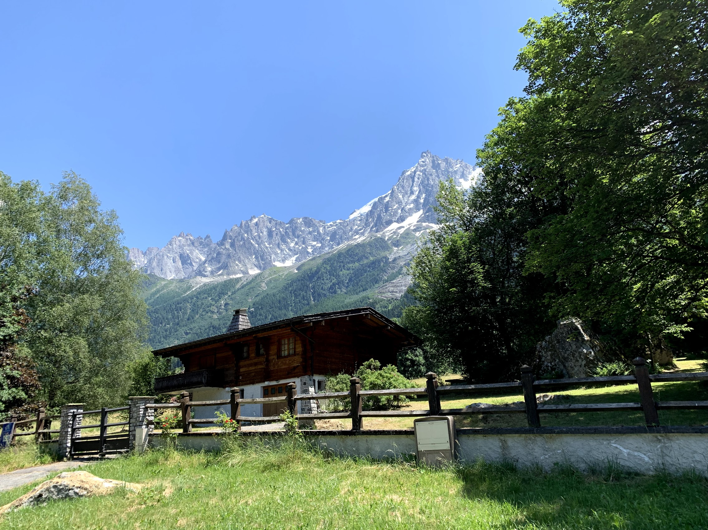

The bus runs every half hour from that stop and I'd missed it by 2-3 minutes, so I 
decided to keep walking toward town. It was hot, but I'm *soooo* glad I made the trek.

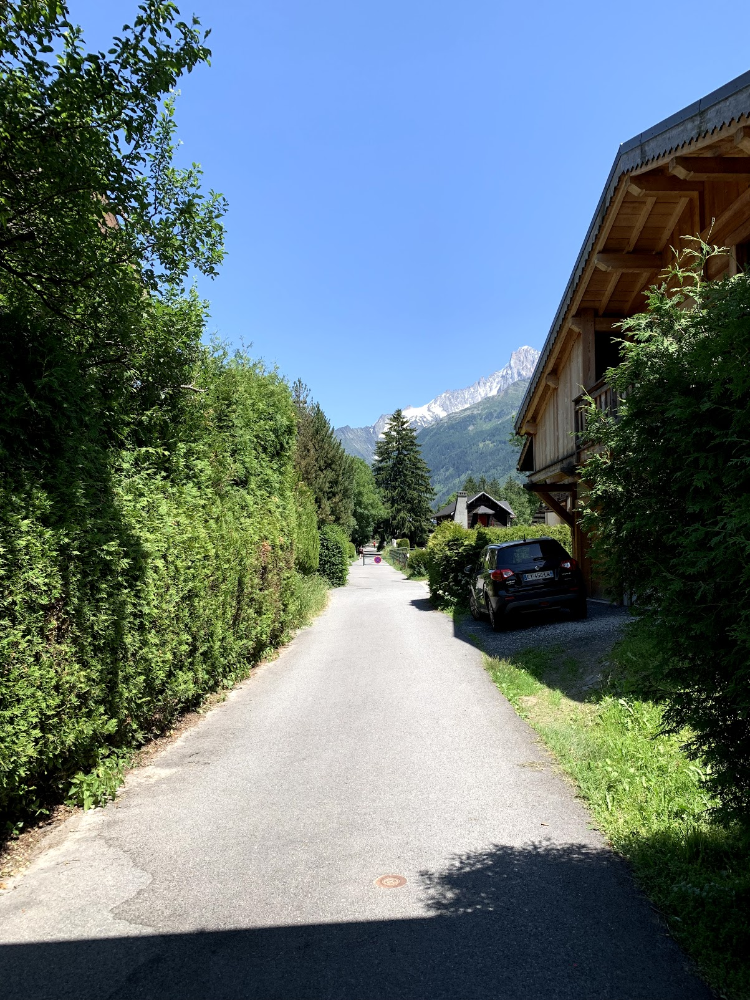
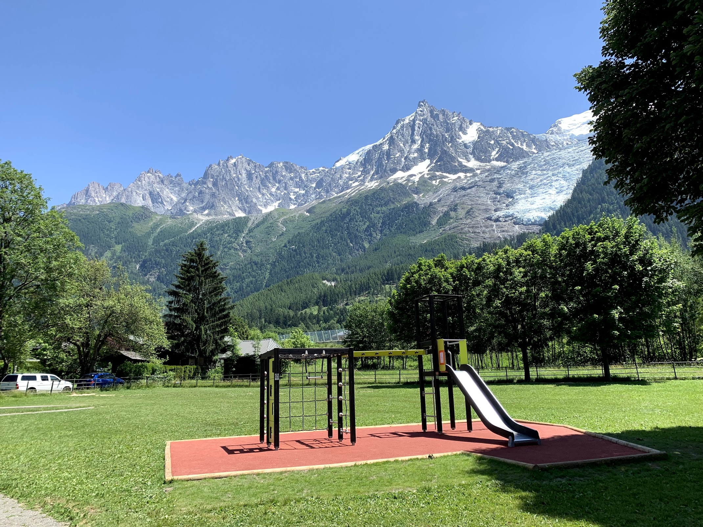

Since the Chamonix trip was fairly spontaneous, I hadn't done much research into 
activities. The tourist office fixed me up. There's a cable car that goes to 
[Aiguille du Midi](https://www.chamonix.net/english/leisure/sightseeing/aiguille-du-midi), 3842m up! 
[On the other side of Chamonix](https://www.chamonix.com/planpraz-brevent,82,en.html)
is the gondola to Plan Praz (up to 2000m) and then a cable car onward to Brévent (2525m). 
Then there's the [Montenvers Train](https://www.chamonix.com/montenvers-mer-de-glace,81,en.html), 
a [rack railway](https://en.wikipedia.org/wiki/Rack_railway) to Mer de Glace at 1913m. It was
mid-afternoon at this point and the launch point to Brévent was the closest, so I decided to
give that a go. There's a fairly steep walk up to the base, I'd had a big lunch and a beer or two, 
and it was like 92 degrees out, but I made it to the ticket hut... only to discover that I was 
already too late for that day: the car to Brévent was already closed, and if I wanted to still 
go to Plan Praz I could do that but I'd only have about an hour up there. I bailed on that idea, 
decided I'd make a fresh start in the morning, and made my walk back down to town. 

I wandered around central Chamonix for another hour or two, then caught the bus from Chamonix Sud 
to the Mercure. 

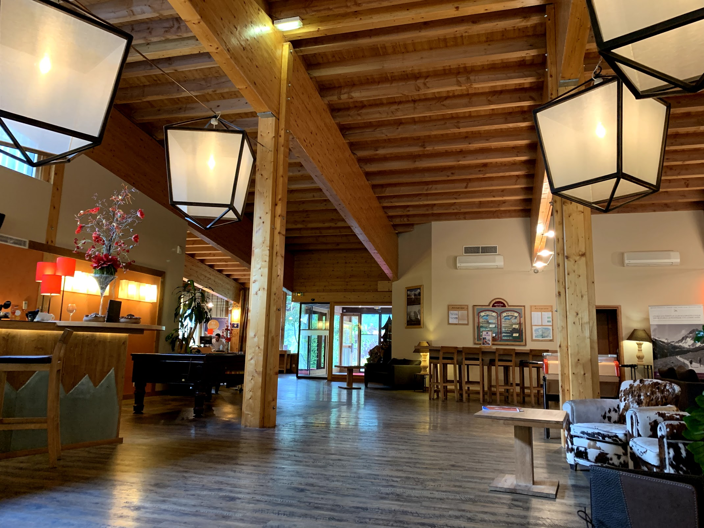

Dinner was at the hotel:

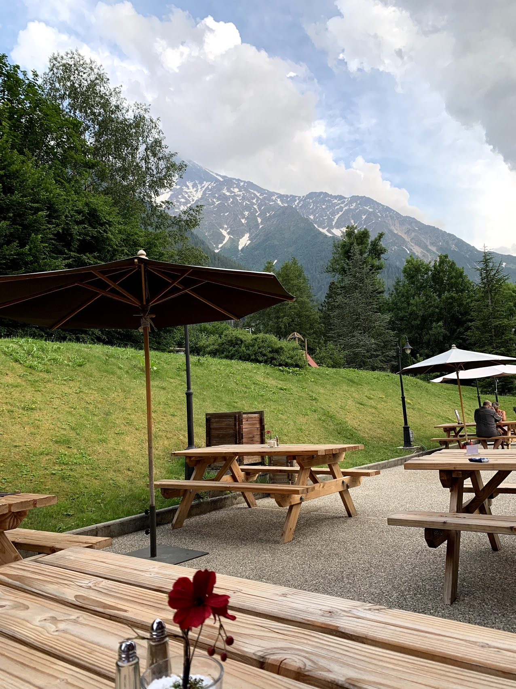

... followed by [the most intense thunderstorm I've experienced since leaving Florida  
in 2013](https://vimeo.com/350173369). It was wild. Even the staff was left 
wondering wtf was going on. Eventually the show was over and I turned in.

**Day 2 in Chamonix**

Pack stuff and move hotels. This is when my pack-and-move frustration started to set in. I 
hopped the bus right outside the hotel and made my way to Chamonix Sud and the 
[Heliopic Hotel](https://www.heliopic-hotel-spa.com/), more in the middle of things. 

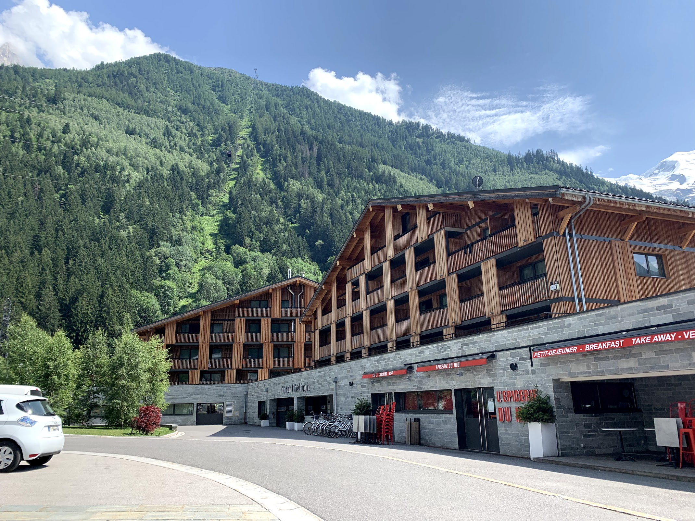

Aiguille du Midi was memorable. The complex at the top would make a formidable 
zombieproof fortress. I was thankful for my hoodie -- the temperature went from 
around 68F to 36F between mid-point and top.

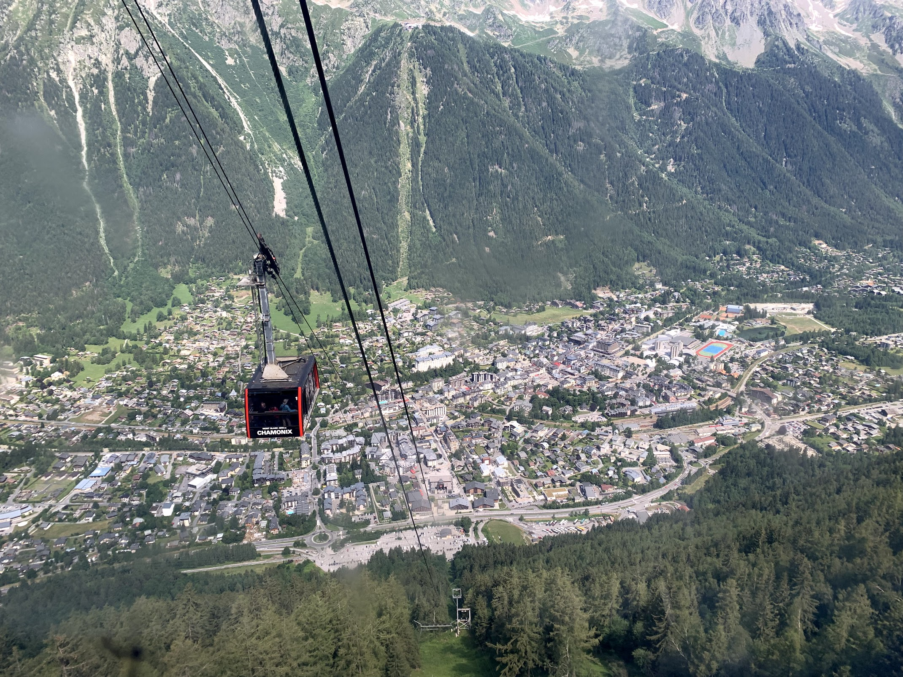
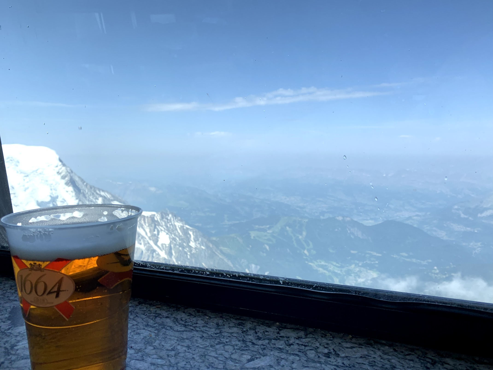
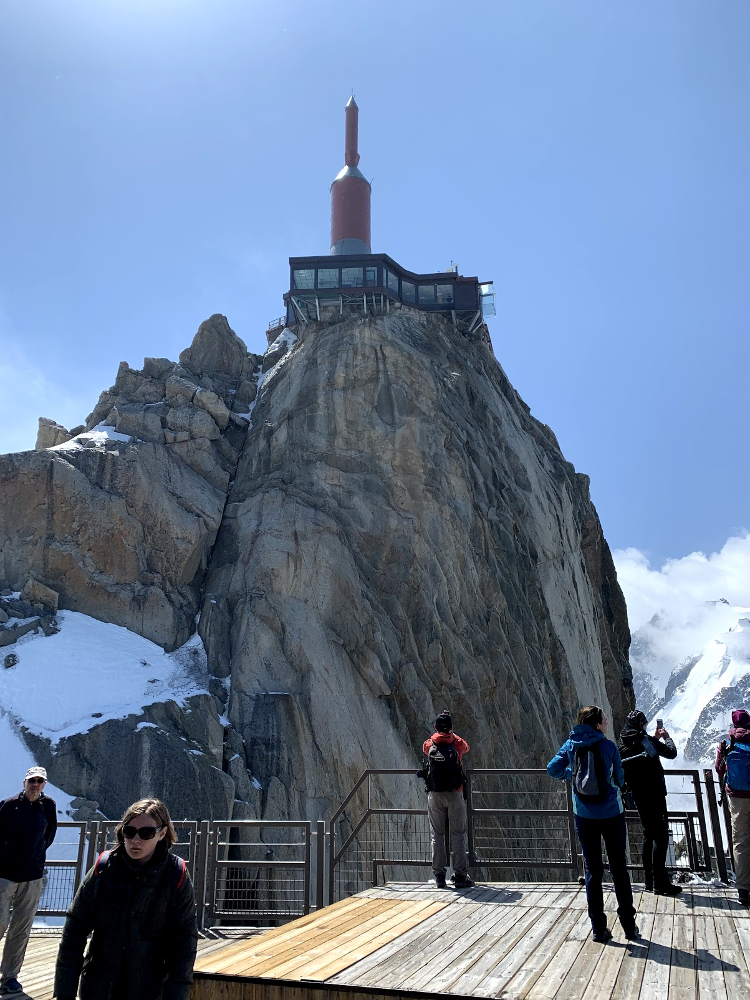
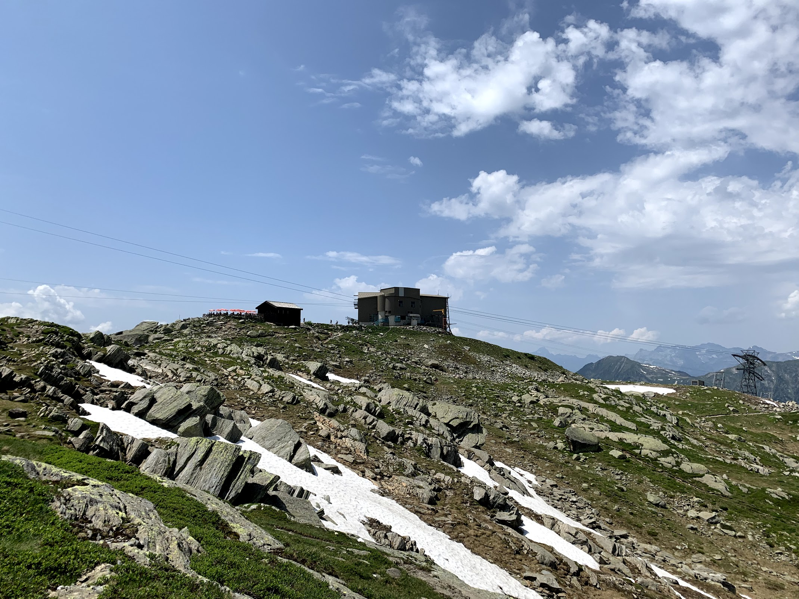

I had strongly considered hiking down from the mid-point but I was short on 
water and the trail (at least at the top) was not well marked and difficult 
to follow. If I recall, the vertical drop from there was ~1000-1200 feet. I
would make a similar downhill hike in Interlaken two days later, destroying 
my quad and calf muscles in the process.

Instead, I had a "hot dog" at the Aiguille du Midi mid-point:
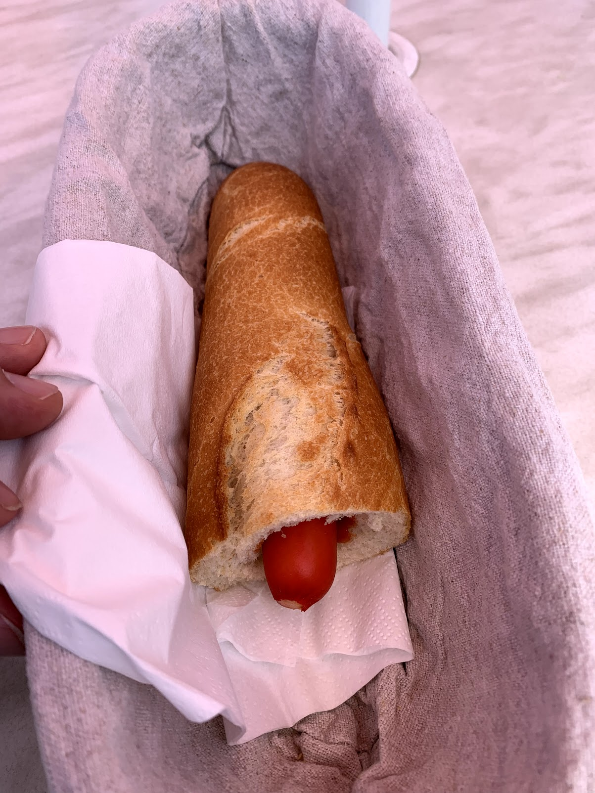

And sat on the balcony of my room at the Heliopic and watch the cable cars go by:
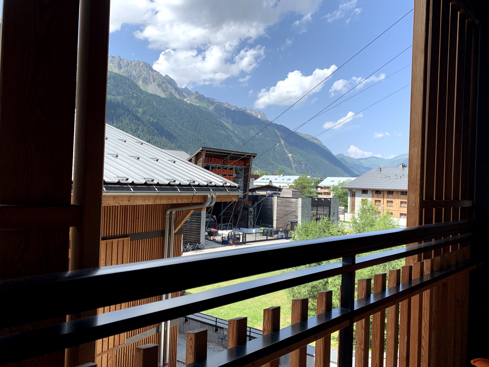

Later in the evening, me and my laptop would make a rain-soaked dash from 
[Pointe Isabelle](https://goo.gl/maps/MuV6LRqyCyfBzLzC7) back to the hotel. 

## Interlaken

[Interlaken](https://en.wikipedia.org/wiki/Interlaken) is achingly beautiful. It's ridiculous, really.
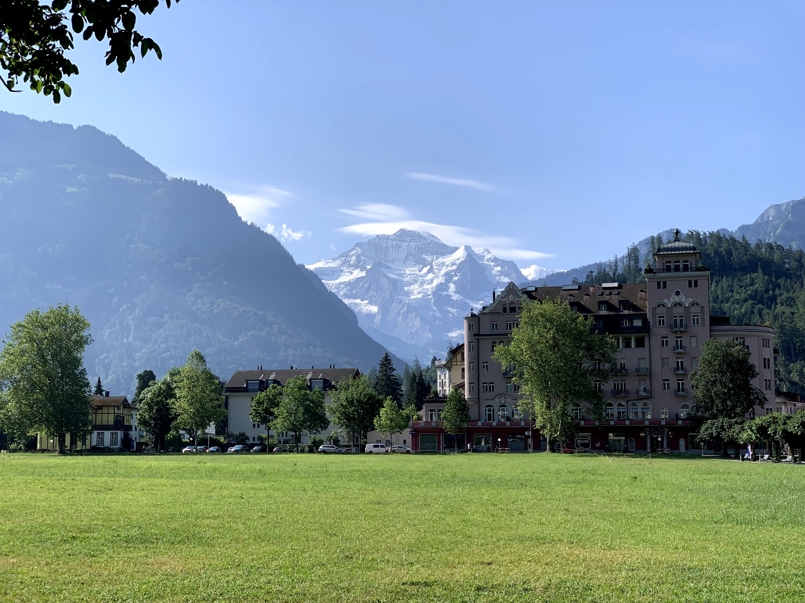

Second, my trip up and down the hill. I took the 
[Harderbahn](https://www.jungfrau.ch/en-gb/corporate/jungfrau-railways/jungfraubahn-holding-ag/harderbahn-ag/) funicular up [Harder Kuln](https://www.jungfrau.ch/en-gb/harder-kulm/) with 
the goal of hiking back down before my 2:05pm train. 

Amazing views up there, with expensive but unsurprising pricing.
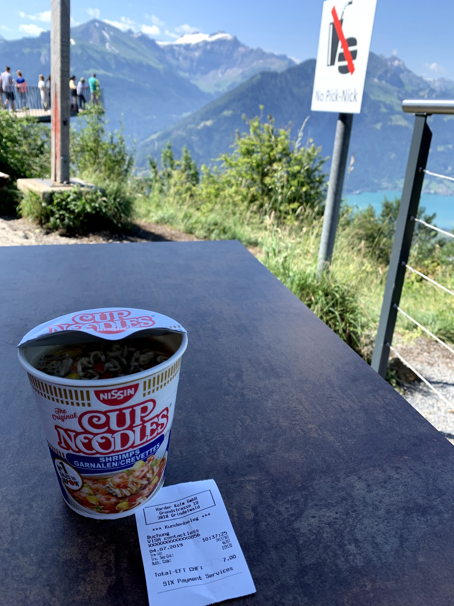

I'm still feeling the impact the hike down had on my body. It's 
around a 400m vertical hike and my legs were *not* prepared. I managed to 
make it down the hill (despite getting lost for about 10 minutes) but my legs 
were in not-good shape by the end. Sure enough, the following three days were 
*really* rough for walking, and I'm still feeling some soreness in my calf 
muscles here eight days later. 

Sitting at the top, feasting on my $7 Cup Noodles, I was well-positioned to see 
hikers who were reaching the top. Whereas I would be gasping for breath and possibly 
praying for the sweet release of death, the hikers I witnessed seemed no worse for 
wear.

Third, my hotel. It's decidedly no-frills, but was exactly what I was looking for. 
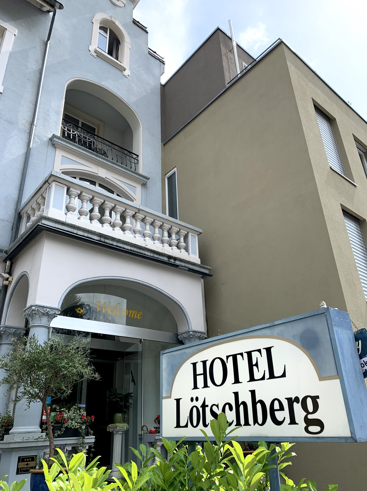

See that balcony above the welcome sign? That was my room. It was a single-person room 
and only $110/ni, which was quite the deal compared to the other swankier places in town.
There aren't amenities here like food and beverage, pool, and the like, but they 
have a friendly and functional living room downstairs, plus a sun deck with loungers 
and a large working table on the first (which is really the second) floor. The staff 
was exceedingly friendly, and it's also very close to the Interlaken-West train 
station and a mall. 

My plan was to use Interlaken as my base for day-tripping down to Lauterbrunnen and 
Mürren but I ran out of time. Next time?

## Geneva

When arriving, I was in and out of the Geneva airport in around 20 minutes from when 
the airplane door opened. That includes walking, clearing customs and immigration, 
getting my bag from baggage claim, and walking outside and into a taxi. Being the 
first person off the plane probably helped *some*, but they were processing 
people and bags pretty efficiently nonetheless. Amazing, and quite welcome after 20 
hours of travel.

Geneva grew on me quickly. It's large enough for there to be a proper transit in place and 
an airport with decent connections, but small enough where you feel like you could 
be confident after a few months of living there. As a tourist, 
key locations like the airport, central train station, the lake, and other points 
of interest were easy to get to using the (free to tourists!) transit system. Language 
was never a serious problem; there were a few hiccups (like chatting with a cider vendor 
at the Carouge farmers market) but we worked through them without too much fuss. 

I was very pleased with my "home" hotel, the 
[ibis Styles Geneve Carouge Hotel](https://www.accorhotels.com/gb/hotel-6863-ibis-styles-geneve-carouge/index.shtml). 
First and foremost, they had air conditioning. This is not always a guarantee in Geneva, even in 
more expensive hotels. We were in the midst of a heat wave and the A/C was a lifesaver, 
especially recovering from jet lag. Second, the hotel is very new. Google 
was still showing the old buildings that used to be there when I was exploring in 
VR with Google Earth. Breakfast and coffee was great, and the staff was friendly. And the 
best part is that it's *literally* across the street from where my friend lives. 

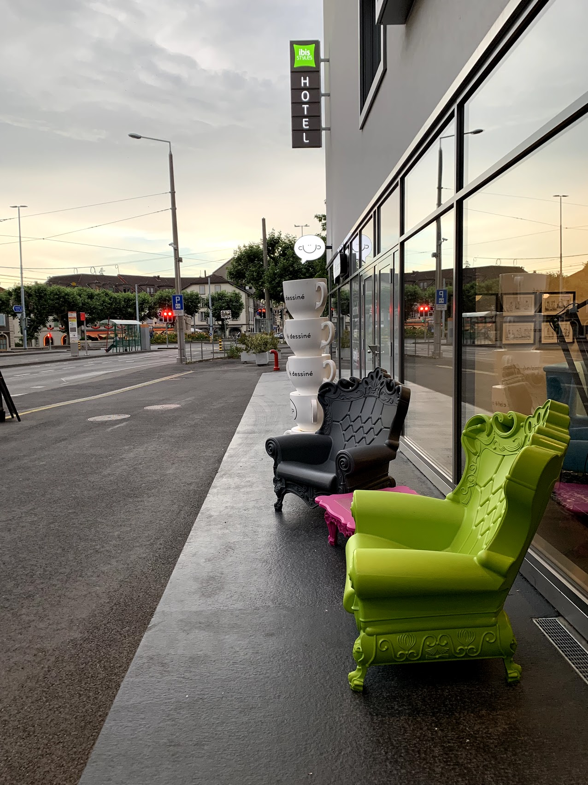

The 12 and 18 trains stop right outside the hotel. Central Geneva and the [regional 
train station](http://www.geneva.info/gare-cornavin/) were easily accessible using 
either of these trains, which run every 4 minutes during busy times. If you take the 18 train 
all the way to the end it terminates at [CERN](https://visit.cern/tours). 

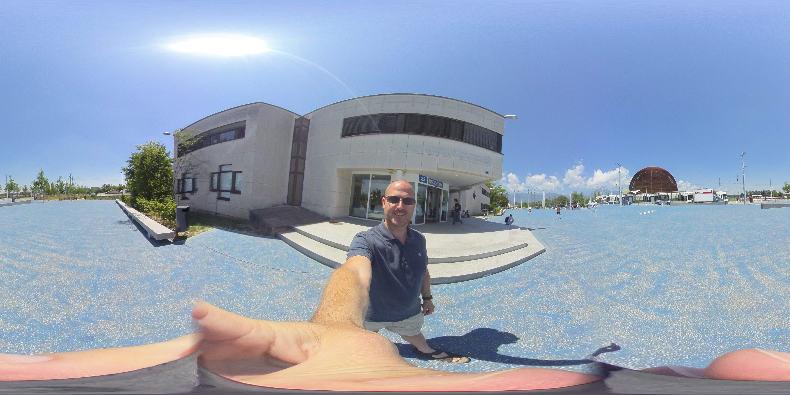

All of this wraps around the beautiful Lake Geneva (locally, Lac Léman). As mentioned above,
I arrived in Geneva in the midst of a heat wave. Friend Joshua and I managed through Saturday's 
heat in part by good eats and wine at a street food festival, but Sunday we relented and 
hit [Bains des Pâquis a/k/a "the beach"](https://www.bains-des-paquis.ch/en) and the 
~18C / ~64F lake water. It was... brisk but refreshing. We did several other lake-oriented 
things, like [UN Port](https://unport.org/) and [Baby Beach](https://www.geneve.com/en/attractions/baby-beach/),
but the Bains des Pâquis was my favorite.

There's so much more I want to write about Geneva but I don't want to drone on. I'll end with this: 
it's the only European city I've been to so far that I could imagine living and raising my kids in. 
